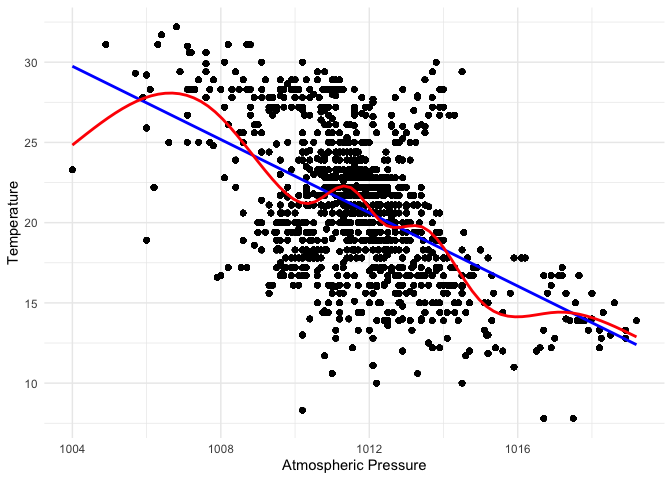
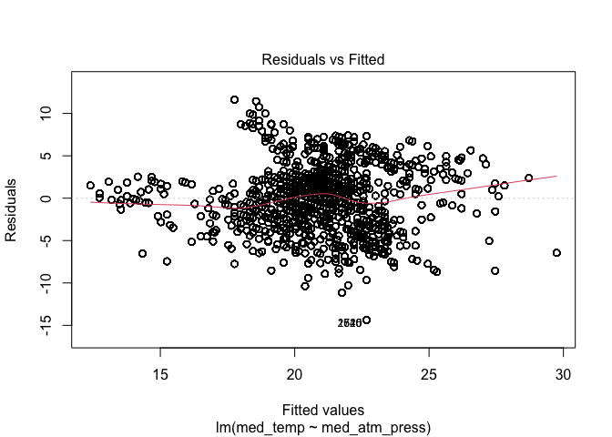
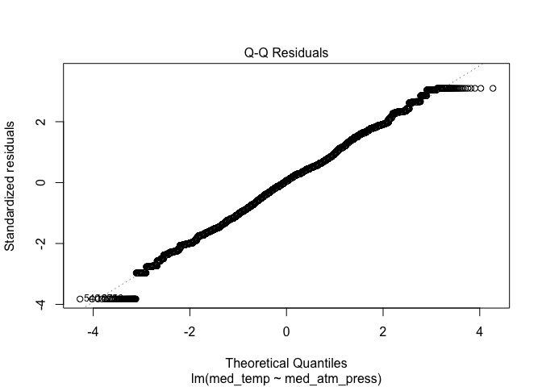
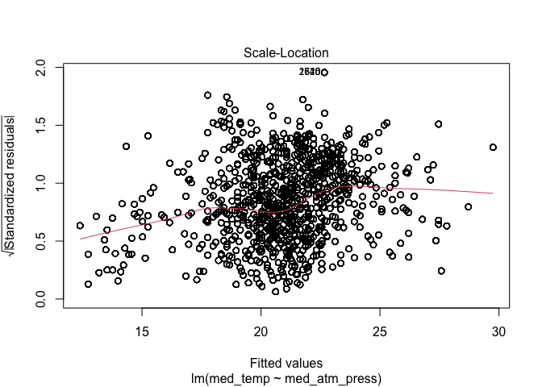
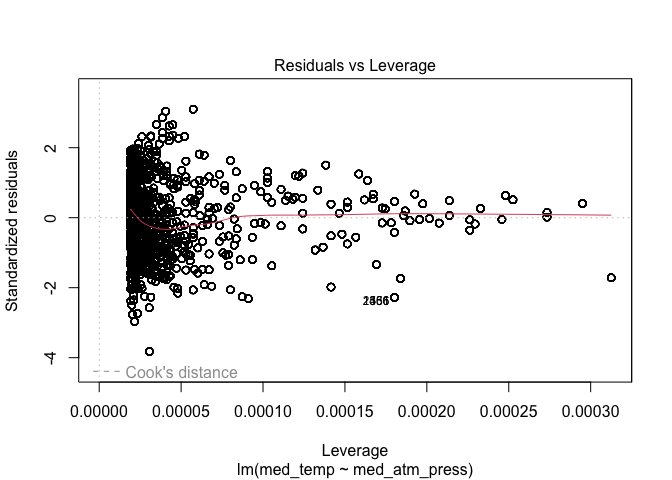
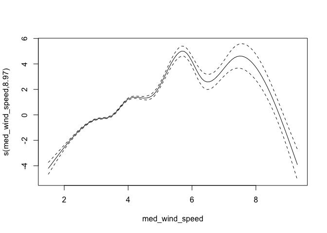

Lab 05 - Data Wrangling
================

# Learning goals

- Use the `merge()` function to join two datasets.
- Deal with missings and impute data.
- Identify relevant observations using `quantile()`.
- Practice your GitHub skills.

# Lab description

For this lab we will be dealing with the meteorological dataset `met`.
In this case, we will use `data.table` to answer some questions
regarding the `met` dataset, while at the same time practice your
Git+GitHub skills for this project.

This markdown document should be rendered using `github_document`
document.

# Part 1: Setup a Git project and the GitHub repository

1.  Go to wherever you are planning to store the data on your computer,
    and create a folder for this project

2.  In that folder, save [this
    template](https://github.com/JSC370/JSC370-2024/blob/main/labs/lab05/lab05-wrangling-gam.Rmd)
    as “README.Rmd”. This will be the markdown file where all the magic
    will happen.

3.  Go to your GitHub account and create a new repository of the same
    name that your local folder has, e.g., “JSC370-labs”.

4.  Initialize the Git project, add the “README.Rmd” file, and make your
    first commit.

5.  Add the repo you just created on GitHub.com to the list of remotes,
    and push your commit to origin while setting the upstream.

Most of the steps can be done using command line:

``` sh
# Step 1
cd ~/Documents
mkdir JSC370-labs
cd JSC370-labs

# Step 2
wget https://raw.githubusercontent.com/JSC370/JSC370-2024/main/labs/lab05/lab05-wrangling-gam.Rmd
mv lab05-wrangling-gam.Rmd README.Rmd
# if wget is not available,
curl https://raw.githubusercontent.com/JSC370/JSC370-2024/main/labs/lab05/lab05-wrangling-gam.Rmd --output README.Rmd

# Step 3
# Happens on github

# Step 4
git init
git add README.Rmd
git commit -m "First commit"

# Step 5
git remote add origin git@github.com:[username]/JSC370-labs
git push -u origin master
```

You can also complete the steps in R (replace with your paths/username
when needed)

``` r
# Step 1
setwd("~/Documents")
dir.create("JSC370-labs")
setwd("JSC370-labs")

# Step 2
download.file(
  "https://raw.githubusercontent.com/JSC370/JSC370-2024/main/labs/lab05/lab05-wrangling-gam.Rmd",
  destfile = "README.Rmd"
  )

# Step 3: Happens on Github

# Step 4
system("git init && git add README.Rmd")
system('git commit -m "First commit"')

# Step 5
system("git remote add origin git@github.com:[username]/JSC370-labs")
system("git push -u origin master")
```

Once you are done setting up the project, you can now start working with
the MET data.

## Setup in R

1.  Load the `data.table` (and the `dtplyr` and `dplyr` packages),
    `mgcv`, `ggplot2`, `leaflet`, `kableExtra`.

``` r
library(data.table)
library(dtplyr)
library(dplyr)
```

    ## 
    ## Attaching package: 'dplyr'

    ## The following objects are masked from 'package:data.table':
    ## 
    ##     between, first, last

    ## The following objects are masked from 'package:stats':
    ## 
    ##     filter, lag

    ## The following objects are masked from 'package:base':
    ## 
    ##     intersect, setdiff, setequal, union

``` r
library(mgcv)
```

    ## Loading required package: nlme

    ## 
    ## Attaching package: 'nlme'

    ## The following object is masked from 'package:dplyr':
    ## 
    ##     collapse

    ## This is mgcv 1.9-0. For overview type 'help("mgcv-package")'.

``` r
library(ggplot2)
library(leaflet)
library(kableExtra)
```

    ## 
    ## Attaching package: 'kableExtra'

    ## The following object is masked from 'package:dplyr':
    ## 
    ##     group_rows

``` r
library(tidyr)
library(knitr)
library(styler)
```

``` r
fn <- "https://raw.githubusercontent.com/JSC370/JSC370-2024/main/data/met_all_2023.gz"
if (!file.exists("met_all_2023.gz"))
  download.file(fn, destfile = "met_all_2023.gz")
met <- data.table::fread("met_all_2023.gz")
```

2.  Load the met data from
    <https://github.com/JSC370/JSC370-2024/main/data/met_all_2023.gz> or
    (Use
    <https://raw.githubusercontent.com/JSC370/JSC370-2024/main/data/met_all_2023.gz>
    to download programmatically), and also the station data. For the
    latter, you can use the code we used during lecture to pre-process
    the stations data:

``` r
# Download the data
stations <- fread("ftp://ftp.ncdc.noaa.gov/pub/data/noaa/isd-history.csv")
stations[, USAF := as.integer(USAF)]
```

    ## Warning in eval(jsub, SDenv, parent.frame()): NAs introduced by coercion

``` r
# Dealing with NAs and 999999
stations[, USAF   := fifelse(USAF == 999999, NA_integer_, USAF)]
stations[, CTRY   := fifelse(CTRY == "", NA_character_, CTRY)]
stations[, STATE  := fifelse(STATE == "", NA_character_, STATE)]

# Selecting the three relevant columns, and keeping unique records
stations <- unique(stations[, list(USAF, CTRY, STATE, LAT, LON)])

# Dropping NAs
stations <- stations[!is.na(USAF)]

# Removing duplicates
stations[, n := 1:.N, by = .(USAF)]
stations <- stations[n == 1,][, n := NULL]

# Read in the met data and fix lat, lon, temp
met$lat <- met$lat/1000
met$lon <- met$lon/1000
met$wind.sp <- met$wind.sp/10
met$temp <- met$temp/10
met$dew.point <- met$dew.point/10
met$atm.press <- met$atm.press/10
```

3.  Merge the data as we did during the lecture. Use the `merge()` code
    and you can also try the tidy way with `left_join()`

``` r
mer <- merge(met, stations, 
             by.x = "USAFID", by.y="USAF",
             all.x = TRUE, all.y = FALSE)
```

## Question 1: Identifying Representative Stations

Across all weather stations, which stations have the median values of
temperature, wind speed, and atmospheric pressure? Using the
`quantile()` function, identify these three stations. Do they coincide?

``` r
# Calculate the median values for temperature, wind speed, and atmospheric pressure
national_median_temp <- quantile(mer$temp, probs = 0.5, na.rm = TRUE)
national_median_wind_speed <- quantile(mer$wind.sp, probs = 0.5, na.rm = TRUE)
national_median_atm_pressure <- quantile(mer$atm.press, probs = 0.5, na.rm = TRUE)
```

Next identify the stations have these median values.

``` r
get_mode <- function(x) {
  ux <- unique(x)
  ux[which.max(tabulate(match(x, ux)))]
}
mer_by_stations <- mer %>% 
  # filter(!is.na(temp) & !is.na(wind.sp) & !is.na(atm.press)) %>%
  group_by(USAFID) %>% 
  summarise(
    med_temp = median(temp, na.rm = TRUE),
    med_wind_speed = median(wind.sp,na.rm = TRUE),
    med_atm_press = median(atm.press,na.rm = TRUE),
    state = get_mode(STATE),
    lat = median(lat),
    lon = median(lon),
    elev = median(elev)
            )
nrow(mer_by_stations)
```

    ## [1] 1852

``` r
# Find stations where these median values occur
stations_median_temp <- unique(mer_by_stations$USAFID[which(mer_by_stations$med_temp == national_median_temp)])
stations_median_wind_speed <- unique(mer_by_stations$USAFID[which(mer_by_stations$med_wind_speed == national_median_wind_speed)])
stations_median_atm_pressure <- unique(mer_by_stations$USAFID[which(mer_by_stations$med_atm_press == national_median_atm_pressure)])
# Output the stations with median values
cat("Stations with median temperature:", stations_median_temp, "\n")
```

    ## Stations with median temperature: 720263 720312 720327 722076 722180 722196 722197 723075 723086 723110 723119 723190 723194 723200 723658 723895 724010 724345 724356 724365 724373 724380 724397 724454 724517 724585 724815 724838 725116 725317 725326 725340 725450 725472 725473 725480 725499 725513 725720 726515 726525 726546 726556 726560 727570 727845 727900 745046 746410 747808

``` r
cat("Stations with median wind speed:", stations_median_wind_speed, "\n")
```

    ## Stations with median wind speed: 720110 720113 720258 720261 720266 720267 720268 720272 720283 720284 720293 720296 720303 720304 720306 720307 720309 720314 720323 720330 720333 720344 720351 720358 720367 720371 720373 720374 720377 720379 720384 720395 720405 720406 720412 720414 720415 720426 720447 720481 720528 720531 720542 720543 720544 720575 720578 720581 720586 720589 720596 720601 720602 720607 720611 720612 720613 720627 720633 720638 720639 720643 720647 720651 720652 720655 720713 720734 720771 720839 720903 720904 720927 720928 720929 720932 720942 720944 720961 721031 721042 721044 721048 722003 722006 722011 722020 722026 722029 722032 722033 722038 722039 722041 722055 722059 722067 722081 722082 722085 722089 722090 722093 722094 722097 722098 722099 722103 722108 722114 722120 722123 722124 722125 722129 722130 722138 722140 722149 722151 722156 722157 722160 722164 722165 722168 722170 722172 722180 722182 722185 722198 722202 722213 722221 722230 722235 722239 722244 722248 722249 722252 722256 722261 722268 722269 722270 722279 722280 722291 722310 722314 722316 722320 722323 722329 722330 722331 722343 722346 722350 722354 722362 722390 722404 722405 722410 722427 722429 722430 722444 722447 722470 722480 722485 722489 722542 722552 722587 722588 722600 722728 722740 722749 722780 722784 722787 722823 722897 722899 722903 722928 722934 722956 722972 723030 723034 723035 723060 723066 723068 723069 723074 723087 723095 723100 723106 723108 723109 723115 723119 723120 723122 723140 723146 723170 723190 723194 723230 723240 723260 723270 723273 723280 723290 723300 723306 723340 723346 723403 723406 723407 723416 723434 723441 723444 723449 723495 723536 723537 723560 723626 723629 723710 723762 723840 723895 723896 723910 723940 723990 724007 724030 724036 724043 724055 724056 724058 724060 724066 724075 724095 724100 724107 724110 724116 724175 724177 724230 724233 724235 724237 724238 724240 724284 724288 724297 724320 724330 724336 724338 724345 724347 724365 724373 724375 724384 724395 724400 724420 724430 724450 724454 724455 724460 724462 724463 724468 724475 724490 724502 724504 724507 724519 724520 724550 724555 724556 724560 724565 724625 724627 724666 724673 724674 724675 724676 724677 724699 724700 724768 724769 724770 724800 724810 724815 724837 724880 724885 724915 724973 724975 725025 725027 725029 725037 725045 725046 725059 725064 725065 725069 725080 725085 725087 725088 725103 725116 725117 725118 725124 725125 725126 725127 725140 725145 725157 725170 725172 725175 725180 725190 725196 725207 725229 725235 725247 725256 725266 725267 725292 725314 725326 725345 725354 725370 725373 725374 725375 725383 725384 725387 725394 725395 725405 725406 725408 725409 725414 725416 725417 725418 725420 725430 725440 725453 725454 725456 725462 725463 725464 725465 725466 725467 725469 725479 725480 725487 725488 725490 725493 725494 725497 725498 725513 725514 725515 725533 725540 725541 725556 725564 725565 725566 725570 725700 725705 725717 725724 725750 725760 725776 725825 725867 725920 725976 726055 726060 726064 726077 726079 726170 726190 726223 726225 726355 726357 726358 726360 726364 726380 726384 726385 726387 726391 726395 726396 726404 726405 726409 726410 726413 726415 726416 726419 726426 726430 726435 726444 726452 726455 726457 726463 726466 726467 726480 726487 726502 726503 726509 726514 726530 726550 726555 726561 726562 726563 726567 726568 726569 726574 726577 726584 726589 726596 726626 726660 726665 726667 726700 726720 726764 726770 726776 726810 726830 726836 726875 726880 726883 726886 726904 726940 726980 726986 727033 727120 727347 727437 727444 727453 727455 727456 727469 727470 727476 727505 727507 727508 727515 727517 727550 727566 727684 727686 727700 727720 727755 727790 727810 727834 727845 727850 727855 727857 727920 727924 727930 740035 742060 742071 742513 743700 744104 744662 744666 744672 744865 744989 744994 745048 745057 745430 746710 746716 746925 746930 746940 747040 747043 747540 747570 747680 747760 747809 747900 747918

``` r
cat("Stations with median atmospheric pressure:", stations_median_atm_pressure, "\n")
```

    ## Stations with median atmospheric pressure: 720394 722085 722348 723119 723124 723270 723658 724010 724035 724100 724235 724280 724336 724926 725126 725266 725510 725570 725620 725845 726690 726810

``` r
common_stations <- Reduce(intersect, list(stations_median_temp, stations_median_wind_speed, stations_median_atm_pressure))
cat("Stations with national median temperature, wind speed, and atmospheric pressure:", common_stations)
```

    ## Stations with national median temperature, wind speed, and atmospheric pressure: 723119

Knit the document, commit your changes, and save it on GitHub. Don’t
forget to add `README.md` to the tree, the first time you render it.

## Question 2: Identifying Representative Stations per State

Now let’s find the weather stations by state with closest temperature
and wind speed based on the euclidean distance from these medians.

``` r
temp_windsp_dist <- function(station_temp, state_temp, station_wsp, state_wsp) {
  sqrt((state_temp - station_temp)^2+(state_wsp - station_wsp)^2)
}

mer_by_states <- mer %>% 
  group_by(STATE) %>% 
  summarise(
    state_med_temp = median(temp, na.rm = TRUE),
    state_med_wind_speed = median(wind.sp,na.rm = TRUE),
    state_med_atm_press = median(atm.press,na.rm = TRUE),
    state_med_lat = median(lat),
    state_med_lon = median(lon)
  )
mer_by_states
```

    ## # A tibble: 48 × 6
    ##    STATE state_med_temp state_med_wind_speed state_med_atm_press state_med_lat
    ##    <chr>          <dbl>                <dbl>               <dbl>         <dbl>
    ##  1 AL              23.3                  2.6               1011           32.9
    ##  2 AR              24                    2.6               1011.          35.2
    ##  3 AZ              25.6                  3.6               1009.          33.6
    ##  4 CA              17                    3.6               1013           36.8
    ##  5 CO              15                    3.6               1012.          39.1
    ##  6 CT              19.4                  3.1               1010.          41.4
    ##  7 DE              21.3                  3.6               1010.          39.1
    ##  8 FL              26.7                  3.6               1013.          28.5
    ##  9 GA              23                    2.6               1011.          32.6
    ## 10 IA              22                    3.1               1012.          41.7
    ## # ℹ 38 more rows
    ## # ℹ 1 more variable: state_med_lon <dbl>

``` r
mere_by_stations <- mer_by_stations %>%
  merge(mer_by_states) %>% 
  mutate(dist = temp_windsp_dist(state_temp = state_med_temp,
                                 station_temp = med_temp,
                                 state_wsp = state_med_wind_speed,
                                 station_wsp = med_wind_speed))
  


# Group by state and find closest station
closest_stations <- mere_by_stations %>%
  group_by(state) %>%
  top_n(-1, dist) %>%
  ungroup()

# Select only necessary columns
closest_stations <- closest_stations %>%
  select(USAFID, med_temp, med_wind_speed, state, lat, lon, elev, dist, ) %>% 
  unique()

closest_stations
```

    ## # A tibble: 388 × 8
    ##    USAFID med_temp med_wind_speed state   lat   lon  elev  dist
    ##     <int>    <dbl>          <dbl> <chr> <dbl> <dbl> <dbl> <dbl>
    ##  1 720708     23.3            2.6 MS     32.8 -88.8   165     0
    ##  2 722054     23.3            2.6 AR     35.1 -90.2    65     0
    ##  3 722073     23.3            2.6 NC     35.0 -78.4    45     0
    ##  4 723307     23.3            2.6 MS     33.4 -88.6    80     0
    ##  5 723347     23.3            2.6 TN     36   -89.4   103     0
    ##  6 724350     23.3            2.6 KY     37.1 -88.8   126     0
    ##  7 720348     24              2.6 GA     33.2 -83.2   117     0
    ##  8 720632     24              2.6 SC     33.1 -80.3    17     0
    ##  9 720636     24              2.6 MO     38.4 -93.7   251     0
    ## 10 720738     24              2.6 GA     30.9 -83.9    80     0
    ## # ℹ 378 more rows

Knit the doc and save it on GitHub.

## Question 3: In the Geographic Center?

For each state, identify which station is closest to the geographic
mid-point (median) of the state. Combining these with the stations you
identified in the previous question, use `leaflet()` to visualize all
~100 points in the same figure, applying different colors for the
geographic median and the temperature and wind speed median.

``` r
stations_median_temp_df <- data.frame(USAFID = stations_median_temp, Median_Temperature = national_median_temp)
```

    ## Warning in data.frame(USAFID = stations_median_temp, Median_Temperature =
    ## national_median_temp): row names were found from a short variable and have been
    ## discarded

``` r
stations_median_wind_speed_df <- data.frame(USAFID = stations_median_wind_speed, Median_Wind_Speed = national_median_wind_speed)
```

    ## Warning in data.frame(USAFID = stations_median_wind_speed, Median_Wind_Speed =
    ## national_median_wind_speed): row names were found from a short variable and
    ## have been discarded

``` r
stations_median_atm_pressure_df <- data.frame(USAFID = stations_median_atm_pressure, Median_Atmospheric_Pressure = national_median_atm_pressure)
```

    ## Warning in data.frame(USAFID = stations_median_atm_pressure,
    ## Median_Atmospheric_Pressure = national_median_atm_pressure): row names were
    ## found from a short variable and have been discarded

``` r
calculate_distance <- function(lat1, lon1, lat2, lon2) {
  distance <- sqrt((lat2 - lat1)^2 + (lon2 - lon1)^2)
  return(distance)
}

mere_by_stations <- mere_by_stations %>%
  mutate(geo_dist = calculate_distance(lat, lon, state_med_lat, state_med_lon))

# Find the closest station to the geographic midpoint of each state
geo_closest_stations_by_state <- mere_by_stations %>%
  group_by(state) %>%
  arrange(geo_dist) %>%
  slice(1)

# Create the leaflet map
map <- leaflet(geo_closest_stations_by_state) %>%
  addTiles() %>%
  addCircleMarkers(
    lng = ~lon,
    lat = ~lat,
    color = ~"purple",
    radius = 5,
    popup = ~paste("USAFID: ", USAFID, "<br>",
                   "Median Temperature: ", med_temp, "<br>",
                   "Median Wind Speed: ", med_wind_speed, "<br>",
                   "State: ", state, "<br>",
                   "Latitude: ", lat, "<br>",
                   "Longitude: ", lon, "<br>",
                   "Elevation: ", elev, "<br>",
                   "Geo distance: ", geo_dist, "<br>") 
      
  ) %>% 
  addCircleMarkers(
    data = closest_stations,
    lng = ~lon,
    lat = ~lat,
    color = ~"orange",
    radius = 2,
    popup = ~paste("USAFID: ", USAFID, "<br>",
                   "Median Temperature: ", med_temp, "<br>",
                   "Median Wind Speed: ", med_wind_speed, "<br>",
                   "State: ", state, "<br>",
                   "Latitude: ", lat, "<br>",
                   "Longitude: ", lon, "<br>",
                   "Elevation: ", elev, "<br>",
                   "Wind&temp distance: ", dist, "<br>")
  )
map
```

<div class="leaflet html-widget html-fill-item" id="htmlwidget-158728db3576be183951" style="width:672px;height:480px;"></div>
<script type="application/json" data-for="htmlwidget-158728db3576be183951">{"x":{"options":{"crs":{"crsClass":"L.CRS.EPSG3857","code":null,"proj4def":null,"projectedBounds":null,"options":{}}},"calls":[{"method":"addTiles","args":["https://{s}.tile.openstreetmap.org/{z}/{x}/{y}.png",null,null,{"minZoom":0,"maxZoom":18,"tileSize":256,"subdomains":"abc","errorTileUrl":"","tms":false,"noWrap":false,"zoomOffset":0,"zoomReverse":false,"opacity":1,"zIndex":1,"detectRetina":false,"attribution":"&copy; <a href=\"https://openstreetmap.org/copyright/\">OpenStreetMap<\/a>,  <a href=\"https://opendatacommons.org/licenses/odbl/\">ODbL<\/a>"}]},{"method":"addCircleMarkers","args":[[33.178,35.257,33.466,36.985,39.05,41.384,39.133,28.821,32.633,41.691,43.567,40.483,41.066,38.068,37.578,30.558,42.212,39.173,44.533,43.322,45.544,38.947,32.32,47.517,35.582,48.39,40.893,43.205,40.624,33.45,39.601,40.851,40.28,35.357,44.5,40.218,41.597,33.967,43.767,35.38,31.133,40.219,37.4,44.533,47.445,44.783,39,43.062],[-86.782,-93.095,-111.721,-120.11,-105.516,-72.506,-75.467,-81.81,-83.59999999999999,-93.566,-116.24,-88.95,-86.182,-97.861,-84.77,-92.099,-71.114,-76.684,-69.667,-84.688,-94.05200000000001,-92.68300000000001,-90.078,-111.183,-79.101,-100.024,-97.997,-71.503,-74.669,-105.516,-116.005,-72.619,-83.11499999999999,-96.943,-123.283,-76.855,-71.41200000000001,-80.467,-99.318,-86.246,-97.717,-111.723,-77.517,-72.61499999999999,-122.314,-89.667,-80.274,-108.447],5,null,null,{"interactive":true,"className":"","stroke":true,"color":"purple","weight":5,"opacity":0.5,"fill":true,"fillColor":"purple","fillOpacity":0.2},null,null,["USAFID:  722300 <br> Median Temperature:  22.8 <br> Median Wind Speed:  2.1 <br> State:  AL <br> Latitude:  33.178 <br> Longitude:  -86.782 <br> Elevation:  178 <br> Geo distance:  0.346112698409054 <br>","USAFID:  723429 <br> Median Temperature:  23.3 <br> Median Wind Speed:  2.1 <br> State:  AR <br> Latitude:  35.257 <br> Longitude:  -93.095 <br> Elevation:  123 <br> Geo distance:  0.331072499613002 <br>","USAFID:  722783 <br> Median Temperature:  30.6 <br> Median Wind Speed:  2.6 <br> State:  AZ <br> Latitude:  33.466 <br> Longitude:  -111.721 <br> Elevation:  425 <br> Geo distance:  0.156016024817969 <br>","USAFID:  745046 <br> Median Temperature:  21.7 <br> Median Wind Speed:  3.6 <br> State:  CA <br> Latitude:  36.985 <br> Longitude:  -120.11 <br> Elevation:  77 <br> Geo distance:  0.369153084776493 <br>","USAFID:  726396 <br> Median Temperature:  8 <br> Median Wind Speed:  3.1 <br> State:  CO <br> Latitude:  39.05 <br> Longitude:  -105.516 <br> Elevation:  3438 <br> Geo distance:  0.310575272679595 <br>","USAFID:  720545 <br> Median Temperature:  19 <br> Median Wind Speed:  2.6 <br> State:  CT <br> Latitude:  41.384 <br> Longitude:  -72.506 <br> Elevation:  127 <br> Geo distance:  0.176000000000002 <br>","USAFID:  724088 <br> Median Temperature:  21 <br> Median Wind Speed:  4.1 <br> State:  DE <br> Latitude:  39.133 <br> Longitude:  -75.467 <br> Elevation:  9 <br> Geo distance:  0 <br>","USAFID:  722213 <br> Median Temperature:  25 <br> Median Wind Speed:  3.1 <br> State:  FL <br> Latitude:  28.821 <br> Longitude:  -81.81 <br> Elevation:  23 <br> Geo distance:  0.353220894059229 <br>","USAFID:  722175 <br> Median Temperature:  22.8 <br> Median Wind Speed:  2.85 <br> State:  GA <br> Latitude:  32.633 <br> Longitude:  -83.6 <br> Elevation:  90 <br> Geo distance:  0.11099999999999 <br>","USAFID:  725466 <br> Median Temperature:  22 <br> Median Wind Speed:  3.1 <br> State:  IA <br> Latitude:  41.691 <br> Longitude:  -93.566 <br> Elevation:  277 <br> Geo distance:  0.00900000000000034 <br>","USAFID:  726810 <br> Median Temperature:  20 <br> Median Wind Speed:  3.1 <br> State:  ID <br> Latitude:  43.567 <br> Longitude:  -116.24 <br> Elevation:  874 <br> Geo distance:  0.620239469882397 <br>","USAFID:  724397 <br> Median Temperature:  21.7 <br> Median Wind Speed:  4.1 <br> State:  IL <br> Latitude:  40.483 <br> Longitude:  -88.95 <br> Elevation:  265 <br> Geo distance:  0.345962425705446 <br>","USAFID:  720736 <br> Median Temperature:  20 <br> Median Wind Speed:  4.1 <br> State:  IN <br> Latitude:  41.066 <br> Longitude:  -86.182 <br> Elevation:  241 <br> Geo distance:  0.15467385040788 <br>","USAFID:  724506 <br> Median Temperature:  23.3 <br> Median Wind Speed:  3.6 <br> State:  KS <br> Latitude:  38.068 <br> Longitude:  -97.861 <br> Elevation:  470 <br> Geo distance:  0.210000000000008 <br>","USAFID:  720448 <br> Median Temperature:  20 <br> Median Wind Speed:  3.6 <br> State:  KY <br> Latitude:  37.578 <br> Longitude:  -84.77 <br> Elevation:  312 <br> Geo distance:  0.0129999999999981 <br>","USAFID:  720468 <br> Median Temperature:  27.2 <br> Median Wind Speed:  2.6 <br> State:  LA <br> Latitude:  30.558 <br> Longitude:  -92.099 <br> Elevation:  23 <br> Geo distance:  0.0150000000000006 <br>","USAFID:  744907 <br> Median Temperature:  NA <br> Median Wind Speed:  NA <br> State:  MA <br> Latitude:  42.212 <br> Longitude:  -71.114 <br> Elevation:  194 <br> Geo distance:  0.116275534829991 <br>","USAFID:  724060 <br> Median Temperature:  22.2 <br> Median Wind Speed:  3.1 <br> State:  MD <br> Latitude:  39.173 <br> Longitude:  -76.684 <br> Elevation:  47 <br> Geo distance:  0.192 <br>","USAFID:  726073 <br> Median Temperature:  15.6 <br> Median Wind Speed:  2.6 <br> State:  ME <br> Latitude:  44.533 <br> Longitude:  -69.667 <br> Elevation:  101 <br> Geo distance:  0.134 <br>","USAFID:  725405 <br> Median Temperature:  19.5 <br> Median Wind Speed:  3.1 <br> State:  MI <br> Latitude:  43.322 <br> Longitude:  -84.688 <br> Elevation:  230 <br> Geo distance:  0.111004504413106 <br>","USAFID:  726550 <br> Median Temperature:  21.1 <br> Median Wind Speed:  3.1 <br> State:  MN <br> Latitude:  45.544 <br> Longitude:  -94.052 <br> Elevation:  312 <br> Geo distance:  0.152738338343705 <br>","USAFID:  720869 <br> Median Temperature:  23.9 <br> Median Wind Speed:  2.6 <br> State:  MO <br> Latitude:  38.947 <br> Longitude:  -92.683 <br> Elevation:  218 <br> Geo distance:  0.289110705439976 <br>","USAFID:  722350 <br> Median Temperature:  26.1 <br> Median Wind Speed:  3.1 <br> State:  MS <br> Latitude:  32.32 <br> Longitude:  -90.078 <br> Elevation:  101 <br> Geo distance:  0.575920133351843 <br>","USAFID:  727755 <br> Median Temperature:  16 <br> Median Wind Speed:  3.1 <br> State:  MT <br> Latitude:  47.517 <br> Longitude:  -111.183 <br> Elevation:  1058 <br> Geo distance:  0.599754116284336 <br>","USAFID:  722201 <br> Median Temperature:  21.4 <br> Median Wind Speed:  2.6 <br> State:  NC <br> Latitude:  35.582 <br> Longitude:  -79.101 <br> Elevation:  75 <br> Geo distance:  0.11761377470348 <br>","USAFID:  720867 <br> Median Temperature:  20 <br> Median Wind Speed:  3.6 <br> State:  ND <br> Latitude:  48.39 <br> Longitude:  -100.024 <br> Elevation:  472 <br> Geo distance:  0.594000000000001 <br>","USAFID:  725513 <br> Median Temperature:  21.7 <br> Median Wind Speed:  3.1 <br> State:  NE <br> Latitude:  40.893 <br> Longitude:  -97.997 <br> Elevation:  550 <br> Geo distance:  0.301438219209177 <br>","USAFID:  726050 <br> Median Temperature:  17.2 <br> Median Wind Speed:  2.6 <br> State:  NH <br> Latitude:  43.205 <br> Longitude:  -71.503 <br> Elevation:  105 <br> Geo distance:  0.0753126815350552 <br>","USAFID:  722247 <br> Median Temperature:  19.4 <br> Median Wind Speed:  2.6 <br> State:  NJ <br> Latitude:  40.624 <br> Longitude:  -74.669 <br> Elevation:  30 <br> Geo distance:  0.10223991392798 <br>","USAFID:  722683 <br> Median Temperature:  22 <br> Median Wind Speed:  4.6 <br> State:  NM <br> Latitude:  33.45 <br> Longitude:  -105.516 <br> Elevation:  2077 <br> Geo distance:  0.778052054813807 <br>","USAFID:  724770 <br> Median Temperature:  14.4 <br> Median Wind Speed:  3.1 <br> State:  NV <br> Latitude:  39.601 <br> Longitude:  -116.005 <br> Elevation:  1809 <br> Geo distance:  0.979652999791261 <br>","USAFID:  744865 <br> Median Temperature:  18.9 <br> Median Wind Speed:  3.1 <br> State:  NY <br> Latitude:  40.851 <br> Longitude:  -72.619 <br> Elevation:  20 <br> Geo distance:  0.536710350189002 <br>","USAFID:  720928 <br> Median Temperature:  18 <br> Median Wind Speed:  3.1 <br> State:  OH <br> Latitude:  40.28 <br> Longitude:  -83.115 <br> Elevation:  288 <br> Geo distance:  0.0369999999999919 <br>","USAFID:  722187 <br> Median Temperature:  26.3 <br> Median Wind Speed:  4.1 <br> State:  OK <br> Latitude:  35.357 <br> Longitude:  -96.943 <br> Elevation:  327 <br> Geo distance:  0.178443268295563 <br>","USAFID:  726945 <br> Median Temperature:  15.6 <br> Median Wind Speed:  4.1 <br> State:  OR <br> Latitude:  44.5 <br> Longitude:  -123.283 <br> Elevation:  75 <br> Geo distance:  0.420000000000002 <br>","USAFID:  725118 <br> Median Temperature:  21.1 <br> Median Wind Speed:  3.1 <br> State:  PA <br> Latitude:  40.218 <br> Longitude:  -76.855 <br> Elevation:  106 <br> Geo distance:  0.227107903869501 <br>","USAFID:  725074 <br> Median Temperature:  22 <br> Median Wind Speed:  6.2 <br> State:  RI <br> Latitude:  41.597 <br> Longitude:  -71.412 <br> Elevation:  5 <br> Geo distance:  0.019999999999996 <br>","USAFID:  747900 <br> Median Temperature:  22.8 <br> Median Wind Speed:  3.1 <br> State:  SC <br> Latitude:  33.967 <br> Longitude:  -80.467 <br> Elevation:  74 <br> Geo distance:  0.0999999999999943 <br>","USAFID:  726530 <br> Median Temperature:  21.6 <br> Median Wind Speed:  3.1 <br> State:  SD <br> Latitude:  43.767 <br> Longitude:  -99.318 <br> Elevation:  517 <br> Geo distance:  0.284015844628428 <br>","USAFID:  721031 <br> Median Temperature:  21 <br> Median Wind Speed:  3.1 <br> State:  TN <br> Latitude:  35.38 <br> Longitude:  -86.246 <br> Elevation:  330 <br> Geo distance:  0.213000000000001 <br>","USAFID:  722570 <br> Median Temperature:  28.65 <br> Median Wind Speed:  4.1 <br> State:  TX <br> Latitude:  31.133 <br> Longitude:  -97.717 <br> Elevation:  267 <br> Geo distance:  0.109658560997302 <br>","USAFID:  725724 <br> Median Temperature:  19.4 <br> Median Wind Speed:  3.1 <br> State:  UT <br> Latitude:  40.219 <br> Longitude:  -111.723 <br> Elevation:  1371 <br> Geo distance:  0.293000000000006 <br>","USAFID:  720498 <br> Median Temperature:  20.6 <br> Median Wind Speed:  2.6 <br> State:  VA <br> Latitude:  37.4 <br> Longitude:  -77.517 <br> Elevation:  72 <br> Geo distance:  0.0829999999999984 <br>","USAFID:  726114 <br> Median Temperature:  16.1 <br> Median Wind Speed:  2.1 <br> State:  VT <br> Latitude:  44.533 <br> Longitude:  -72.615 <br> Elevation:  223 <br> Geo distance:  0.0820060973342801 <br>","USAFID:  727930 <br> Median Temperature:  14.4 <br> Median Wind Speed:  3.1 <br> State:  WA <br> Latitude:  47.445 <br> Longitude:  -122.314 <br> Elevation:  132 <br> Geo distance:  0.167999999999999 <br>","USAFID:  726465 <br> Median Temperature:  17 <br> Median Wind Speed:  2.6 <br> State:  WI <br> Latitude:  44.783 <br> Longitude:  -89.667 <br> Elevation:  389 <br> Geo distance:  0.200024998437698 <br>","USAFID:  720328 <br> Median Temperature:  19 <br> Median Wind Speed:  2.6 <br> State:  WV <br> Latitude:  39 <br> Longitude:  -80.274 <br> Elevation:  498 <br> Geo distance:  0.167260276216444 <br>","USAFID:  726720 <br> Median Temperature:  13.9 <br> Median Wind Speed:  3.1 <br> State:  WY <br> Latitude:  43.062 <br> Longitude:  -108.447 <br> Elevation:  1684 <br> Geo distance:  0.27224988521577 <br>"],null,null,{"interactive":false,"permanent":false,"direction":"auto","opacity":1,"offset":[0,0],"textsize":"10px","textOnly":false,"className":"","sticky":true},null]},{"method":"addCircleMarkers","args":[[32.8,35.14,34.976,33.45,36,37.056,33.154,33.063,38.35,30.902,32.304,36.605,32.193,32.564,32.383,32.335,32.2,28.418,34.067,37.1,35.686,30.337,29.174,28.061,39.183,37.659,44.34,44.381,47.473,37.082,40.1,36.855,42.993,40.277,37.321,39.417,41.062,41.688,40.65,42.747,41.94,40.219,42.228,43.171,44.359,46.402,44.638,46.9,48.726,42.493,39.472,25.91,26.918,26,33.183,32.565,33.3,26.079,31.397,35.6,39.725,36.9,33.902,34.383,33.183,34.717,32.917,29.467,34.915,37.974,32.214,31.35,32.514,32.516,38.783,35.633,34.744,36.191,33.909,40.659,39.639,35,33.873,32.483,40.947,45.372,41.828,34.3,34.717,41.584,45.159,46.839,41.352,44.779,37.133,36.383,39.133,41.407,41.276,41.674,41.691,41.019,40.722,41.367,41.299,44.628,44.333,44.319,44.123,44.859,43.683,45.332,45.306,44.756,43.665,33.983,44.68,43.394,41.703,43.041,47.049,47.517,38.967,42.683,38.981,33.917,39.983,37.578,38.909,48.884,48.929,47.29,48.39,47.796,46.768,41.964,40.017,39.592,39.431,38.378,43.108,41.604,41.587,42.776,42.312,43.154,40.733,41.437,44.051,48.941,48.067,46.782,47.646,47.717,48.461,41.771,40.948,42.121,40.734,35.9,36.258,36.904,38.504,39.374,38.76,40.961,43.168,45.669,44.379,44.832,44.217,41.613,43.677,35.38,43.621,44.074,39.078,43.073,42.681,42.55,41.7,46.447,45.15,44.018,42.85,39.609,42.468,40.777,42.224,45.117,43.234,38.15,39.667,34.607,39.56,39.9,43.642,45.462,45.733,43.965,46.87,46.117,39.404,41.483,40.133,40.3,43.111,40.026,41.779,42.264,40.443,44.468,44.739,48.559,47.767,32.338,31.421,35.056,36.199,32.815,34.124,40.45,42.584,42.108,41.798,42.545,44.267,45.807,42.59,45.548,45.813,47.38,44.567,34.2,34.021,32.576,32.867,37.298,43.338,44.316,42.543,38.955,40.031,40.617,43.235,45.506,40.367,40.711,39.531,39.366,37.9,39.106,39.8,40.859,41.51,41.328,41.937,41.243,42.231,42.577,43.141,44.55,44.927,43.567,45.698,47.593,34.083,48.784,48.48,48.405,46.942,46.218,48.941,38.69,42.436,42.049,43.208,42.615,45.644,43.645,43.65,48.856,48.154,38.817,42.69,43.433,41.921,44.614,41.351,33.924,39.302,39.508,42.746,47.326,47.622,40.851,36.665,33.25,34,33.828,34.4,44.753,30.219,31.883,34.116,34.979,31.356,31.267,35.344,34.791,36.617,39.05,40.46,40.751,41.01,41.259,45.228,35.57,35.133,33.317,36.682,34.649,38.341,39.044,39.991,39.906,40.412,37.89,41.896,40.235,41.623,41.122,40.204,43.904,46.095,36.018,34.229,34.181,34.617,34.315,34.689,33.227,35.178,39.332,34.269,35.541,45.236,42.046,33.967,35.317,33.967,33.587,34.679,35.554,44.589,45.147,45.56,45.559,32.955,26.585,32.359,29.339,29.36,43.211,45.419,40.333,41.3,40.225,40.204,43.581,39.417,42.617,44.267,43.426,46.725,34.259,35.951,42.57,41.509,41.876,46.03,45.305,47.686,42.93,41.444,37.513,39.217,34.717],[-88.833,-90.236,-78.364,-88.583,-89.40900000000001,-88.774,-83.241,-80.279,-93.68300000000001,-83.881,-90.411,-94.738,-82.372,-82.985,-86.34999999999999,-88.751,-81.87,-81.324,-106.9,-113.6,-117.69,-81.51300000000001,-81.072,-81.75700000000001,-119.733,-122.121,-105.541,-106.719,-111.382,-121.597,-75.267,-84.85599999999999,-84.139,-74.816,-79.206,-118.716,-73.705,-69.99299999999999,-75.44799999999999,-73.79900000000001,-83.435,-111.723,-85.54600000000001,-86.23699999999999,-89.837,-94.127,-90.188,-95.06699999999999,-94.61199999999999,-79.276,-76.17,-80.283,-81.994,-80.241,-96.59,-97.30800000000001,-111.666,-80.16200000000001,-84.895,-92.45,-91.444,-94.017,-87.31399999999999,-89.55,-80.033,-79.95,-80.633,-81.206,-88.604,-92.691,-83.128,-85.667,-92.58799999999999,-84.94199999999999,-93.8,-77.383,-87.59999999999999,-94.491,-94.85899999999999,-91.327,-90.77800000000001,-77.982,-88.48999999999999,-81.73699999999999,-91.511,-94.746,-94.16,-81.633,-80.84999999999999,-95.339,-93.843,-96.663,-89.15300000000001,-95.033,-76.59999999999999,-97.8,-121.433,-95.047,-91.673,-93.02200000000001,-93.566,-93.35899999999999,-95.026,-91.15000000000001,-93.114,-93.22799999999999,-93.31699999999999,-94.502,-93.261,-94.38200000000001,-93.367,-95.651,-96.42400000000001,-94.081,-92.93300000000001,-83.66800000000001,-84.729,-70.708,-86.821,-88.23699999999999,-91.745,-111.183,-76.333,-90.45,-76.922,-84.517,-75.867,-84.77,-121.351,-99.621,-103.297,-101.581,-100.024,-103.254,-100.894,-100.568,-74.59999999999999,-84.226,-83.777,-121.958,-78.938,-88.08499999999999,-83.80500000000001,-84.59999999999999,-85.241,-93.32599999999999,-99,-99.639,-101.601,-95.348,-96.18300000000001,-100.757,-101.44,-104.183,-119.52,-88.48099999999999,-87.18300000000001,-87.905,-73.416,-100.4,-76.172,-76.193,-77.30500000000001,-99.83,-87.599,-98.313,-95.20999999999999,-96.992,-98.223,-93.471,-93.917,-90.595,-92.18000000000001,-86.246,-96.21599999999999,-93.553,-77.55800000000001,-92.611,-91.974,-94.18300000000001,-94.917,-95.212,-93.217,-92.831,-73.95,-110.755,-71.295,-79.95,-83.73999999999999,-87.633,-123.357,-122.55,-119.876,-120.075,-104.848,-105.116,-70.304,-69.596,-87.083,-107.95,-68.017,-122.893,-77.97499999999999,-73.133,-80.283,-78.31699999999999,-76.104,-82.46299999999999,-80.697,-84.456,-109.512,-73.15000000000001,-85.568,-93.396,-116.816,-90.221,-110.846,-89.986,-95.878,-117.137,-119.122,-105.016,-70.91500000000001,-77.98399999999999,-78.63500000000001,-113.768,-86.25,-108.546,-117.864,-122.955,-88.113,-92.83199999999999,-72.017,-118.365,-118.447,-116.993,-117.133,-81.20399999999999,-73.61,-69.797,-83.178,-121.081,-86.251,-74.25,-93.624,-91.98099999999999,-83.81699999999999,-86.375,-84.395,-75.078,-85.967,-84.416,-121.85,-74.056,-72.828,-72.04900000000001,-72.682,-76.922,-83.331,-100,-89.345,-89.533,-89.625,-116.24,-118.834,-95.77500000000001,-118.033,-97.63200000000001,-99.236,-97.371,-98.018,-100.245,-97.90300000000001,-75.36199999999999,-93.869,-93.848,-95.833,-89.59099999999999,-95.31999999999999,-95.58,-94.986,-95.697,-94.517,-76.867,-88.304,-83.867,-84.586,-88.73099999999999,-71.806,-118.332,-80.224,-119.768,-86.09699999999999,-106.948,-117.527,-72.619,-88.373,-81.383,-80.367,-79.122,-80.117,-95.556,-81.876,-81.56699999999999,-84.851,-89.78700000000001,-85.751,-85.717,-77.965,-79.36799999999999,-87.41200000000001,-96.767,-91.428,-95.413,-95.26000000000001,-95.76000000000001,-96.00700000000001,-77.05,-78.93300000000001,-79.31699999999999,-101.505,-112.422,-75.51300000000001,-84.672,-82.877,-84.21899999999999,-86.947,-121.226,-88.251,-85.39400000000001,-98.949,-100.668,-100.59,-92.492,-118.285,-75.67100000000001,-86.256,-79.33499999999999,-79.733,-81.10899999999999,-86.006,-84.27500000000001,-86.066,-94.31,-86.858,-78.39,-93.986,-90.108,-86.083,-77.633,-80.8,-80.209,-86.685,-87.179,-92.485,-94.50700000000001,-93.608,-93.265,-84.264,-81.861,-95.404,-98.47199999999999,-99.17400000000001,-90.187,-91.773,-82.517,-85.06699999999999,-83.352,-84.532,-116.523,-77.383,-89.033,-88.517,-88.703,-94.38200000000001,-118.413,-85.081,-77.714,-74.265,-71.021,-91.443,-85.27500000000001,-117.321,-71.43600000000001,-106.827,-122.501,-104.633,-120.566],2,null,null,{"interactive":true,"className":"","stroke":true,"color":"orange","weight":5,"opacity":0.5,"fill":true,"fillColor":"orange","fillOpacity":0.2},null,null,["USAFID:  720708 <br> Median Temperature:  23.3 <br> Median Wind Speed:  2.6 <br> State:  MS <br> Latitude:  32.8 <br> Longitude:  -88.833 <br> Elevation:  165 <br> Wind&temp distance:  0 <br>","USAFID:  722054 <br> Median Temperature:  23.3 <br> Median Wind Speed:  2.6 <br> State:  AR <br> Latitude:  35.14 <br> Longitude:  -90.236 <br> Elevation:  65 <br> Wind&temp distance:  0 <br>","USAFID:  722073 <br> Median Temperature:  23.3 <br> Median Wind Speed:  2.6 <br> State:  NC <br> Latitude:  34.976 <br> Longitude:  -78.364 <br> Elevation:  45 <br> Wind&temp distance:  0 <br>","USAFID:  723307 <br> Median Temperature:  23.3 <br> Median Wind Speed:  2.6 <br> State:  MS <br> Latitude:  33.45 <br> Longitude:  -88.583 <br> Elevation:  80 <br> Wind&temp distance:  0 <br>","USAFID:  723347 <br> Median Temperature:  23.3 <br> Median Wind Speed:  2.6 <br> State:  TN <br> Latitude:  36 <br> Longitude:  -89.409 <br> Elevation:  103 <br> Wind&temp distance:  0 <br>","USAFID:  724350 <br> Median Temperature:  23.3 <br> Median Wind Speed:  2.6 <br> State:  KY <br> Latitude:  37.056 <br> Longitude:  -88.774 <br> Elevation:  126 <br> Wind&temp distance:  0 <br>","USAFID:  720348 <br> Median Temperature:  24 <br> Median Wind Speed:  2.6 <br> State:  GA <br> Latitude:  33.154 <br> Longitude:  -83.241 <br> Elevation:  117 <br> Wind&temp distance:  0 <br>","USAFID:  720632 <br> Median Temperature:  24 <br> Median Wind Speed:  2.6 <br> State:  SC <br> Latitude:  33.063 <br> Longitude:  -80.279 <br> Elevation:  17 <br> Wind&temp distance:  0 <br>","USAFID:  720636 <br> Median Temperature:  24 <br> Median Wind Speed:  2.6 <br> State:  MO <br> Latitude:  38.35 <br> Longitude:  -93.683 <br> Elevation:  251 <br> Wind&temp distance:  0 <br>","USAFID:  720738 <br> Median Temperature:  24 <br> Median Wind Speed:  2.6 <br> State:  GA <br> Latitude:  30.902 <br> Longitude:  -83.881 <br> Elevation:  80 <br> Wind&temp distance:  0 <br>","USAFID:  720787 <br> Median Temperature:  24 <br> Median Wind Speed:  2.6 <br> State:  MS <br> Latitude:  32.304 <br> Longitude:  -90.411 <br> Elevation:  75 <br> Wind&temp distance:  0 <br>","USAFID:  722092 <br> Median Temperature:  24 <br> Median Wind Speed:  2.6 <br> State:  OK <br> Latitude:  36.605 <br> Longitude:  -94.738 <br> Elevation:  254 <br> Wind&temp distance:  0 <br>","USAFID:  722134 <br> Median Temperature:  24 <br> Median Wind Speed:  2.6 <br> State:  GA <br> Latitude:  32.193 <br> Longitude:  -82.372 <br> Elevation:  84 <br> Wind&temp distance:  0 <br>","USAFID:  722217 <br> Median Temperature:  24 <br> Median Wind Speed:  2.6 <br> State:  GA <br> Latitude:  32.564 <br> Longitude:  -82.985 <br> Elevation:  94 <br> Wind&temp distance:  0 <br>","USAFID:  722265 <br> Median Temperature:  24 <br> Median Wind Speed:  2.6 <br> State:  AL <br> Latitude:  32.383 <br> Longitude:  -86.35 <br> Elevation:  52 <br> Wind&temp distance:  0 <br>","USAFID:  722340 <br> Median Temperature:  24 <br> Median Wind Speed:  2.6 <br> State:  MS <br> Latitude:  32.335 <br> Longitude:  -88.751 <br> Elevation:  94 <br> Wind&temp distance:  0 <br>","USAFID:  722691 <br> Median Temperature:  24 <br> Median Wind Speed:  2.6 <br> State:  GA <br> Latitude:  32.2 <br> Longitude:  -81.87 <br> Elevation:  34 <br> Wind&temp distance:  0 <br>","USAFID:  722050 <br> Median Temperature:  25.6 <br> Median Wind Speed:  3.6 <br> State:  FL <br> Latitude:  28.418 <br> Longitude:  -81.324 <br> Elevation:  32 <br> Wind&temp distance:  0 <br>","USAFID:  723620 <br> Median Temperature:  25.7 <br> Median Wind Speed:  3.6 <br> State:  NM <br> Latitude:  34.067 <br> Longitude:  -106.9 <br> Elevation:  1486 <br> Wind&temp distance:  0.0999999999999979 <br>","USAFID:  724754 <br> Median Temperature:  25.6 <br> Median Wind Speed:  3.6 <br> State:  UT <br> Latitude:  37.1 <br> Longitude:  -113.6 <br> Elevation:  896 <br> Wind&temp distance:  0 <br>","USAFID:  746120 <br> Median Temperature:  25.6 <br> Median Wind Speed:  3.6 <br> State:  CA <br> Latitude:  35.686 <br> Longitude:  -117.69 <br> Elevation:  696 <br> Wind&temp distance:  0 <br>","USAFID:  747820 <br> Median Temperature:  25.6 <br> Median Wind Speed:  3.6 <br> State:  FL <br> Latitude:  30.337 <br> Longitude:  -81.513 <br> Elevation:  12 <br> Wind&temp distance:  0 <br>","USAFID:  747870 <br> Median Temperature:  25.6 <br> Median Wind Speed:  3.6 <br> State:  FL <br> Latitude:  29.174 <br> Longitude:  -81.072 <br> Elevation:  12 <br> Wind&temp distance:  0 <br>","USAFID:  747931 <br> Median Temperature:  25.6 <br> Median Wind Speed:  3.6 <br> State:  FL <br> Latitude:  28.061 <br> Longitude:  -81.757 <br> Elevation:  45 <br> Wind&temp distance:  0 <br>","USAFID:  720549 <br> Median Temperature:  17 <br> Median Wind Speed:  3.6 <br> State:  NV <br> Latitude:  39.183 <br> Longitude:  -119.733 <br> Elevation:  1432 <br> Wind&temp distance:  0 <br>","USAFID:  725850 <br> Median Temperature:  15 <br> Median Wind Speed:  3.6 <br> State:  CA <br> Latitude:  37.659 <br> Longitude:  -122.121 <br> Elevation:  14 <br> Wind&temp distance:  0 <br>","USAFID:  726650 <br> Median Temperature:  15 <br> Median Wind Speed:  3.6 <br> State:  WY <br> Latitude:  44.34 <br> Longitude:  -105.541 <br> Elevation:  1323 <br> Wind&temp distance:  0 <br>","USAFID:  726654 <br> Median Temperature:  15 <br> Median Wind Speed:  3.6 <br> State:  WY <br> Latitude:  44.381 <br> Longitude:  -106.719 <br> Elevation:  1514 <br> Wind&temp distance:  0 <br>","USAFID:  727750 <br> Median Temperature:  15 <br> Median Wind Speed:  3.6 <br> State:  MT <br> Latitude:  47.473 <br> Longitude:  -111.382 <br> Elevation:  1115 <br> Wind&temp distance:  0 <br>","USAFID:  749484 <br> Median Temperature:  15 <br> Median Wind Speed:  3.6 <br> State:  CA <br> Latitude:  37.082 <br> Longitude:  -121.597 <br> Elevation:  86 <br> Wind&temp distance:  0 <br>","USAFID:  720304 <br> Median Temperature:  19.4 <br> Median Wind Speed:  3.1 <br> State:  PA <br> Latitude:  40.1 <br> Longitude:  -75.267 <br> Elevation:  92 <br> Wind&temp distance:  0 <br>","USAFID:  720379 <br> Median Temperature:  19.4 <br> Median Wind Speed:  3.1 <br> State:  KY <br> Latitude:  36.855 <br> Longitude:  -84.856 <br> Elevation:  294 <br> Wind&temp distance:  0 <br>","USAFID:  722346 <br> Median Temperature:  19.4 <br> Median Wind Speed:  3.1 <br> State:  MI <br> Latitude:  42.993 <br> Longitude:  -84.139 <br> Elevation:  224 <br> Wind&temp distance:  0 <br>","USAFID:  724095 <br> Median Temperature:  19.4 <br> Median Wind Speed:  3.1 <br> State:  NJ <br> Latitude:  40.277 <br> Longitude:  -74.816 <br> Elevation:  65 <br> Wind&temp distance:  0 <br>","USAFID:  724100 <br> Median Temperature:  19.4 <br> Median Wind Speed:  3.1 <br> State:  VA <br> Latitude:  37.321 <br> Longitude:  -79.206 <br> Elevation:  286 <br> Wind&temp distance:  0 <br>","USAFID:  724885 <br> Median Temperature:  19.4 <br> Median Wind Speed:  3.1 <br> State:  NV <br> Latitude:  39.417 <br> Longitude:  -118.716 <br> Elevation:  1199 <br> Wind&temp distance:  0 <br>","USAFID:  725037 <br> Median Temperature:  19.4 <br> Median Wind Speed:  3.1 <br> State:  NY <br> Latitude:  41.062 <br> Longitude:  -73.705 <br> Elevation:  121 <br> Wind&temp distance:  0 <br>","USAFID:  725069 <br> Median Temperature:  19.4 <br> Median Wind Speed:  3.1 <br> State:  MA <br> Latitude:  41.688 <br> Longitude:  -69.993 <br> Elevation:  21 <br> Wind&temp distance:  0 <br>","USAFID:  725170 <br> Median Temperature:  19.4 <br> Median Wind Speed:  3.1 <br> State:  PA <br> Latitude:  40.65 <br> Longitude:  -75.448 <br> Elevation:  117 <br> Wind&temp distance:  0 <br>","USAFID:  725180 <br> Median Temperature:  19.4 <br> Median Wind Speed:  3.1 <br> State:  NY <br> Latitude:  42.747 <br> Longitude:  -73.799 <br> Elevation:  89 <br> Wind&temp distance:  0 <br>","USAFID:  725418 <br> Median Temperature:  19.4 <br> Median Wind Speed:  3.1 <br> State:  MI <br> Latitude:  41.94 <br> Longitude:  -83.435 <br> Elevation:  187 <br> Wind&temp distance:  0 <br>","USAFID:  725724 <br> Median Temperature:  19.4 <br> Median Wind Speed:  3.1 <br> State:  UT <br> Latitude:  40.219 <br> Longitude:  -111.723 <br> Elevation:  1371 <br> Wind&temp distance:  0 <br>","USAFID:  726357 <br> Median Temperature:  19.4 <br> Median Wind Speed:  3.1 <br> State:  MI <br> Latitude:  42.228 <br> Longitude:  -85.546 <br> Elevation:  266 <br> Wind&temp distance:  0 <br>","USAFID:  726360 <br> Median Temperature:  19.4 <br> Median Wind Speed:  3.1 <br> State:  MI <br> Latitude:  43.171 <br> Longitude:  -86.237 <br> Elevation:  193 <br> Wind&temp distance:  0 <br>","USAFID:  726452 <br> Median Temperature:  19.4 <br> Median Wind Speed:  3.1 <br> State:  WI <br> Latitude:  44.359 <br> Longitude:  -89.837 <br> Elevation:  311 <br> Wind&temp distance:  0 <br>","USAFID:  726555 <br> Median Temperature:  19.4 <br> Median Wind Speed:  3.1 <br> State:  MN <br> Latitude:  46.402 <br> Longitude:  -94.127 <br> Elevation:  374 <br> Wind&temp distance:  0 <br>","USAFID:  726574 <br> Median Temperature:  19.4 <br> Median Wind Speed:  3.1 <br> State:  WI <br> Latitude:  44.638 <br> Longitude:  -90.188 <br> Elevation:  389 <br> Wind&temp distance:  0 <br>","USAFID:  727453 <br> Median Temperature:  19.4 <br> Median Wind Speed:  3.1 <br> State:  MN <br> Latitude:  46.9 <br> Longitude:  -95.067 <br> Elevation:  440 <br> Wind&temp distance:  0 <br>","USAFID:  727476 <br> Median Temperature:  19.4 <br> Median Wind Speed:  3.1 <br> State:  MN <br> Latitude:  48.726 <br> Longitude:  -94.612 <br> Elevation:  330 <br> Wind&temp distance:  0 <br>","USAFID:  744989 <br> Median Temperature:  19.4 <br> Median Wind Speed:  3.1 <br> State:  NY <br> Latitude:  42.493 <br> Longitude:  -79.276 <br> Elevation:  211 <br> Wind&temp distance:  0 <br>","USAFID:  724057 <br> Median Temperature:  21.3 <br> Median Wind Speed:  3.6 <br> State:  MD <br> Latitude:  39.472 <br> Longitude:  -76.17 <br> Elevation:  18 <br> Wind&temp distance:  0 <br>","USAFID:  722024 <br> Median Temperature:  26.7 <br> Median Wind Speed:  3.6 <br> State:  FL <br> Latitude:  25.91 <br> Longitude:  -80.283 <br> Elevation:  3 <br> Wind&temp distance:  0 <br>","USAFID:  722034 <br> Median Temperature:  26.7 <br> Median Wind Speed:  3.6 <br> State:  FL <br> Latitude:  26.918 <br> Longitude:  -81.994 <br> Elevation:  8 <br> Wind&temp distance:  0 <br>","USAFID:  722037 <br> Median Temperature:  26.7 <br> Median Wind Speed:  3.6 <br> State:  FL <br> Latitude:  26 <br> Longitude:  -80.241 <br> Elevation:  3 <br> Wind&temp distance:  0 <br>","USAFID:  722541 <br> Median Temperature:  26.7 <br> Median Wind Speed:  3.6 <br> State:  TX <br> Latitude:  33.183 <br> Longitude:  -96.59 <br> Elevation:  178 <br> Wind&temp distance:  0 <br>","USAFID:  722593 <br> Median Temperature:  26.7 <br> Median Wind Speed:  3.6 <br> State:  TX <br> Latitude:  32.565 <br> Longitude:  -97.308 <br> Elevation:  213 <br> Wind&temp distance:  0 <br>","USAFID:  722786 <br> Median Temperature:  26.7 <br> Median Wind Speed:  3.6 <br> State:  AZ <br> Latitude:  33.3 <br> Longitude:  -111.666 <br> Elevation:  421 <br> Wind&temp distance:  0 <br>","USAFID:  747830 <br> Median Temperature:  26.7 <br> Median Wind Speed:  3.6 <br> State:  FL <br> Latitude:  26.079 <br> Longitude:  -80.162 <br> Elevation:  3 <br> Wind&temp distance:  0 <br>","USAFID:  720257 <br> Median Temperature:  23 <br> Median Wind Speed:  2.6 <br> State:  GA <br> Latitude:  31.397 <br> Longitude:  -84.895 <br> Elevation:  65 <br> Wind&temp distance:  0 <br>","USAFID:  720401 <br> Median Temperature:  23 <br> Median Wind Speed:  2.6 <br> State:  AR <br> Latitude:  35.6 <br> Longitude:  -92.45 <br> Elevation:  157 <br> Wind&temp distance:  0 <br>","USAFID:  720476 <br> Median Temperature:  23 <br> Median Wind Speed:  2.6 <br> State:  MO <br> Latitude:  39.725 <br> Longitude:  -91.444 <br> Elevation:  235 <br> Wind&temp distance:  0 <br>","USAFID:  720479 <br> Median Temperature:  23 <br> Median Wind Speed:  2.6 <br> State:  MO <br> Latitude:  36.9 <br> Longitude:  -94.017 <br> Elevation:  401 <br> Wind&temp distance:  0 <br>","USAFID:  720505 <br> Median Temperature:  23 <br> Median Wind Speed:  2.6 <br> State:  AL <br> Latitude:  33.902 <br> Longitude:  -87.314 <br> Elevation:  147 <br> Wind&temp distance:  0 <br>","USAFID:  720541 <br> Median Temperature:  23 <br> Median Wind Speed:  2.6 <br> State:  MS <br> Latitude:  34.383 <br> Longitude:  -89.55 <br> Elevation:  138 <br> Wind&temp distance:  0 <br>","USAFID:  720598 <br> Median Temperature:  23 <br> Median Wind Speed:  2.6 <br> State:  SC <br> Latitude:  33.183 <br> Longitude:  -80.033 <br> Elevation:  22 <br> Wind&temp distance:  0 <br>","USAFID:  720605 <br> Median Temperature:  23 <br> Median Wind Speed:  2.6 <br> State:  SC <br> Latitude:  34.717 <br> Longitude:  -79.95 <br> Elevation:  73 <br> Wind&temp distance:  0 <br>","USAFID:  720609 <br> Median Temperature:  23 <br> Median Wind Speed:  2.6 <br> State:  SC <br> Latitude:  32.917 <br> Longitude:  -80.633 <br> Elevation:  31 <br> Wind&temp distance:  0 <br>","USAFID:  720672 <br> Median Temperature:  23 <br> Median Wind Speed:  2.6 <br> State:  FL <br> Latitude:  29.467 <br> Longitude:  -81.206 <br> Elevation:  10 <br> Wind&temp distance:  0 <br>","USAFID:  720924 <br> Median Temperature:  23 <br> Median Wind Speed:  2.6 <br> State:  MS <br> Latitude:  34.915 <br> Longitude:  -88.604 <br> Elevation:  130 <br> Wind&temp distance:  0 <br>","USAFID:  720949 <br> Median Temperature:  23 <br> Median Wind Speed:  2.6 <br> State:  MO <br> Latitude:  37.974 <br> Longitude:  -92.691 <br> Elevation:  323 <br> Wind&temp distance:  0 <br>","USAFID:  720962 <br> Median Temperature:  23 <br> Median Wind Speed:  2.6 <br> State:  GA <br> Latitude:  32.214 <br> Longitude:  -83.128 <br> Elevation:  93 <br> Wind&temp distance:  0 <br>","USAFID:  722238 <br> Median Temperature:  23 <br> Median Wind Speed:  2.6 <br> State:  AL <br> Latitude:  31.35 <br> Longitude:  -85.667 <br> Elevation:  97 <br> Wind&temp distance:  0 <br>","USAFID:  722251 <br> Median Temperature:  23 <br> Median Wind Speed:  2.6 <br> State:  LA <br> Latitude:  32.514 <br> Longitude:  -92.588 <br> Elevation:  95 <br> Wind&temp distance:  0 <br>","USAFID:  722255 <br> Median Temperature:  23 <br> Median Wind Speed:  2.6 <br> State:  GA <br> Latitude:  32.516 <br> Longitude:  -84.942 <br> Elevation:  120 <br> Wind&temp distance:  0 <br>","USAFID:  722367 <br> Median Temperature:  23 <br> Median Wind Speed:  2.6 <br> State:  MO <br> Latitude:  38.783 <br> Longitude:  -93.8 <br> Elevation:  243 <br> Wind&temp distance:  0 <br>","USAFID:  723065 <br> Median Temperature:  23 <br> Median Wind Speed:  2.6 <br> State:  NC <br> Latitude:  35.633 <br> Longitude:  -77.383 <br> Elevation:  8 <br> Wind&temp distance:  0 <br>","USAFID:  723235 <br> Median Temperature:  23 <br> Median Wind Speed:  2.6 <br> State:  AL <br> Latitude:  34.744 <br> Longitude:  -87.6 <br> Elevation:  171 <br> Wind&temp distance:  0 <br>","USAFID:  723443 <br> Median Temperature:  23 <br> Median Wind Speed:  2.6 <br> State:  AR <br> Latitude:  36.191 <br> Longitude:  -94.491 <br> Elevation:  364 <br> Wind&temp distance:  0 <br>","USAFID:  723759 <br> Median Temperature:  23 <br> Median Wind Speed:  2.6 <br> State:  OK <br> Latitude:  33.909 <br> Longitude:  -94.859 <br> Elevation:  144 <br> Wind&temp distance:  0 <br>","USAFID:  725483 <br> Median Temperature:  23 <br> Median Wind Speed:  2.6 <br> State:  IA <br> Latitude:  40.659 <br> Longitude:  -91.327 <br> Elevation:  221 <br> Wind&temp distance:  0 <br>","USAFID:  744663 <br> Median Temperature:  23 <br> Median Wind Speed:  2.6 <br> State:  IL <br> Latitude:  39.639 <br> Longitude:  -90.778 <br> Elevation:  216 <br> Wind&temp distance:  0 <br>","USAFID:  746929 <br> Median Temperature:  23 <br> Median Wind Speed:  2.6 <br> State:  NC <br> Latitude:  35 <br> Longitude:  -77.982 <br> Elevation:  42 <br> Wind&temp distance:  0 <br>","USAFID:  746941 <br> Median Temperature:  23 <br> Median Wind Speed:  2.6 <br> State:  MS <br> Latitude:  33.873 <br> Longitude:  -88.49 <br> Elevation:  69 <br> Wind&temp distance:  0 <br>","USAFID:  747805 <br> Median Temperature:  23 <br> Median Wind Speed:  2.6 <br> State:  GA <br> Latitude:  32.483 <br> Longitude:  -81.737 <br> Elevation:  57 <br> Wind&temp distance:  0 <br>","USAFID:  720309 <br> Median Temperature:  22 <br> Median Wind Speed:  3.1 <br> State:  IA <br> Latitude:  40.947 <br> Longitude:  -91.511 <br> Elevation:  224 <br> Wind&temp distance:  0 <br>","USAFID:  720367 <br> Median Temperature:  22 <br> Median Wind Speed:  3.1 <br> State:  MN <br> Latitude:  45.372 <br> Longitude:  -94.746 <br> Elevation:  360 <br> Wind&temp distance:  0 <br>","USAFID:  720412 <br> Median Temperature:  22 <br> Median Wind Speed:  3.1 <br> State:  IA <br> Latitude:  41.828 <br> Longitude:  -94.16 <br> Elevation:  309 <br> Wind&temp distance:  0 <br>","USAFID:  720596 <br> Median Temperature:  22 <br> Median Wind Speed:  3.1 <br> State:  SC <br> Latitude:  34.3 <br> Longitude:  -81.633 <br> Elevation:  173 <br> Wind&temp distance:  0 <br>","USAFID:  720607 <br> Median Temperature:  22 <br> Median Wind Speed:  3.1 <br> State:  SC <br> Latitude:  34.717 <br> Longitude:  -80.85 <br> Elevation:  148 <br> Wind&temp distance:  0 <br>","USAFID:  722097 <br> Median Temperature:  22 <br> Median Wind Speed:  3.1 <br> State:  IA <br> Latitude:  41.584 <br> Longitude:  -95.339 <br> Elevation:  375 <br> Wind&temp distance:  0 <br>","USAFID:  722114 <br> Median Temperature:  22 <br> Median Wind Speed:  3.1 <br> State:  MN <br> Latitude:  45.159 <br> Longitude:  -93.843 <br> Elevation:  295 <br> Wind&temp distance:  0 <br>","USAFID:  722129 <br> Median Temperature:  22 <br> Median Wind Speed:  3.1 <br> State:  MN <br> Latitude:  46.839 <br> Longitude:  -96.663 <br> Elevation:  280 <br> Wind&temp distance:  0 <br>","USAFID:  722149 <br> Median Temperature:  22 <br> Median Wind Speed:  3.1 <br> State:  IL <br> Latitude:  41.352 <br> Longitude:  -89.153 <br> Elevation:  199 <br> Wind&temp distance:  0 <br>","USAFID:  722168 <br> Median Temperature:  22 <br> Median Wind Speed:  3.1 <br> State:  MN <br> Latitude:  44.779 <br> Longitude:  -95.033 <br> Elevation:  328 <br> Wind&temp distance:  0 <br>","USAFID:  723087 <br> Median Temperature:  22 <br> Median Wind Speed:  3.1 <br> State:  VA <br> Latitude:  37.133 <br> Longitude:  -76.6 <br> Elevation:  4 <br> Wind&temp distance:  0 <br>","USAFID:  723536 <br> Median Temperature:  22 <br> Median Wind Speed:  3.1 <br> State:  OK <br> Latitude:  36.383 <br> Longitude:  -97.8 <br> Elevation:  356 <br> Wind&temp distance:  0 <br>","USAFID:  724837 <br> Median Temperature:  22 <br> Median Wind Speed:  3.1 <br> State:  CA <br> Latitude:  39.133 <br> Longitude:  -121.433 <br> Elevation:  34 <br> Wind&temp distance:  0 <br>","USAFID:  725453 <br> Median Temperature:  22 <br> Median Wind Speed:  3.1 <br> State:  IA <br> Latitude:  41.407 <br> Longitude:  -95.047 <br> Elevation:  360 <br> Wind&temp distance:  0 <br>","USAFID:  725454 <br> Median Temperature:  22 <br> Median Wind Speed:  3.1 <br> State:  IA <br> Latitude:  41.276 <br> Longitude:  -91.673 <br> Elevation:  230 <br> Wind&temp distance:  0 <br>","USAFID:  725464 <br> Median Temperature:  22 <br> Median Wind Speed:  3.1 <br> State:  IA <br> Latitude:  41.674 <br> Longitude:  -93.022 <br> Elevation:  290 <br> Wind&temp distance:  0 <br>","USAFID:  725466 <br> Median Temperature:  22 <br> Median Wind Speed:  3.1 <br> State:  IA <br> Latitude:  41.691 <br> Longitude:  -93.566 <br> Elevation:  277 <br> Wind&temp distance:  0 <br>","USAFID:  725469 <br> Median Temperature:  22 <br> Median Wind Speed:  3.1 <br> State:  IA <br> Latitude:  41.019 <br> Longitude:  -93.359 <br> Elevation:  320 <br> Wind&temp distance:  0 <br>","USAFID:  725479 <br> Median Temperature:  22 <br> Median Wind Speed:  3.1 <br> State:  IA <br> Latitude:  40.722 <br> Longitude:  -95.026 <br> Elevation:  302 <br> Wind&temp distance:  0 <br>","USAFID:  725487 <br> Median Temperature:  22 <br> Median Wind Speed:  3.1 <br> State:  IA <br> Latitude:  41.367 <br> Longitude:  -91.15 <br> Elevation:  167 <br> Wind&temp distance:  0 <br>","USAFID:  725493 <br> Median Temperature:  22 <br> Median Wind Speed:  3.1 <br> State:  IA <br> Latitude:  41.299 <br> Longitude:  -93.114 <br> Elevation:  282 <br> Wind&temp distance:  0 <br>","USAFID:  726562 <br> Median Temperature:  22 <br> Median Wind Speed:  3.1 <br> State:  MN <br> Latitude:  44.628 <br> Longitude:  -93.228 <br> Elevation:  293 <br> Wind&temp distance:  0 <br>","USAFID:  726563 <br> Median Temperature:  22 <br> Median Wind Speed:  3.1 <br> State:  MN <br> Latitude:  44.333 <br> Longitude:  -93.317 <br> Elevation:  322 <br> Wind&temp distance:  0 <br>","USAFID:  726567 <br> Median Temperature:  22 <br> Median Wind Speed:  3.1 <br> State:  MN <br> Latitude:  44.319 <br> Longitude:  -94.502 <br> Elevation:  308 <br> Wind&temp distance:  0 <br>","USAFID:  726568 <br> Median Temperature:  22 <br> Median Wind Speed:  3.1 <br> State:  MN <br> Latitude:  44.123 <br> Longitude:  -93.261 <br> Elevation:  349 <br> Wind&temp distance:  0 <br>","USAFID:  726569 <br> Median Temperature:  22 <br> Median Wind Speed:  3.1 <br> State:  MN <br> Latitude:  44.859 <br> Longitude:  -94.382 <br> Elevation:  323 <br> Wind&temp distance:  0 <br>","USAFID:  726589 <br> Median Temperature:  22 <br> Median Wind Speed:  3.1 <br> State:  MN <br> Latitude:  43.683 <br> Longitude:  -93.367 <br> Elevation:  384 <br> Wind&temp distance:  0 <br>","USAFID:  727507 <br> Median Temperature:  22 <br> Median Wind Speed:  3.1 <br> State:  MN <br> Latitude:  45.332 <br> Longitude:  -95.651 <br> Elevation:  317 <br> Wind&temp distance:  0 <br>","USAFID:  727515 <br> Median Temperature:  22 <br> Median Wind Speed:  3.1 <br> State:  MN <br> Latitude:  45.306 <br> Longitude:  -96.424 <br> Elevation:  335 <br> Wind&temp distance:  0 <br>","USAFID:  727517 <br> Median Temperature:  22 <br> Median Wind Speed:  3.1 <br> State:  MN <br> Latitude:  44.756 <br> Longitude:  -94.081 <br> Elevation:  302 <br> Wind&temp distance:  0 <br>","USAFID:  727566 <br> Median Temperature:  22 <br> Median Wind Speed:  3.1 <br> State:  MN <br> Latitude:  43.665 <br> Longitude:  -92.933 <br> Elevation:  376 <br> Wind&temp distance:  0 <br>","USAFID:  747809 <br> Median Temperature:  22 <br> Median Wind Speed:  3.1 <br> State:  GA <br> Latitude:  33.983 <br> Longitude:  -83.668 <br> Elevation:  287 <br> Wind&temp distance:  0 <br>","USAFID:  722093 <br> Median Temperature:  16 <br> Median Wind Speed:  3.1 <br> State:  MI <br> Latitude:  44.68 <br> Longitude:  -84.729 <br> Elevation:  353 <br> Wind&temp distance:  0 <br>","USAFID:  726064 <br> Median Temperature:  16 <br> Median Wind Speed:  3.1 <br> State:  ME <br> Latitude:  43.394 <br> Longitude:  -70.708 <br> Elevation:  74 <br> Wind&temp distance:  0 <br>","USAFID:  726358 <br> Median Temperature:  16 <br> Median Wind Speed:  3.1 <br> State:  IN <br> Latitude:  41.703 <br> Longitude:  -86.821 <br> Elevation:  200 <br> Wind&temp distance:  0 <br>","USAFID:  726409 <br> Median Temperature:  16 <br> Median Wind Speed:  3.1 <br> State:  WI <br> Latitude:  43.041 <br> Longitude:  -88.237 <br> Elevation:  278 <br> Wind&temp distance:  0 <br>","USAFID:  727444 <br> Median Temperature:  16 <br> Median Wind Speed:  3.1 <br> State:  MN <br> Latitude:  47.049 <br> Longitude:  -91.745 <br> Elevation:  329 <br> Wind&temp distance:  0 <br>","USAFID:  727755 <br> Median Temperature:  16 <br> Median Wind Speed:  3.1 <br> State:  MT <br> Latitude:  47.517 <br> Longitude:  -111.183 <br> Elevation:  1058 <br> Wind&temp distance:  0 <br>","USAFID:  720384 <br> Median Temperature:  21.8 <br> Median Wind Speed:  3.1 <br> State:  MD <br> Latitude:  38.967 <br> Longitude:  -76.333 <br> Elevation:  5 <br> Wind&temp distance:  0 <br>","USAFID:  720586 <br> Median Temperature:  21.8 <br> Median Wind Speed:  3.1 <br> State:  WI <br> Latitude:  42.683 <br> Longitude:  -90.45 <br> Elevation:  312 <br> Wind&temp distance:  0 <br>","USAFID:  722244 <br> Median Temperature:  21.8 <br> Median Wind Speed:  3.1 <br> State:  MD <br> Latitude:  38.981 <br> Longitude:  -76.922 <br> Elevation:  15 <br> Wind&temp distance:  0 <br>","USAFID:  722270 <br> Median Temperature:  21.8 <br> Median Wind Speed:  3.1 <br> State:  GA <br> Latitude:  33.917 <br> Longitude:  -84.517 <br> Elevation:  326 <br> Wind&temp distance:  0 <br>","USAFID:  720408 <br> Median Temperature:  20 <br> Median Wind Speed:  3.6 <br> State:  PA <br> Latitude:  39.983 <br> Longitude:  -75.867 <br> Elevation:  201 <br> Wind&temp distance:  0 <br>","USAFID:  720448 <br> Median Temperature:  20 <br> Median Wind Speed:  3.6 <br> State:  KY <br> Latitude:  37.578 <br> Longitude:  -84.77 <br> Elevation:  312 <br> Wind&temp distance:  0 <br>","USAFID:  720614 <br> Median Temperature:  20 <br> Median Wind Speed:  3.6 <br> State:  CA <br> Latitude:  38.909 <br> Longitude:  -121.351 <br> Elevation:  37 <br> Wind&temp distance:  0 <br>","USAFID:  720853 <br> Median Temperature:  20 <br> Median Wind Speed:  3.6 <br> State:  ND <br> Latitude:  48.884 <br> Longitude:  -99.621 <br> Elevation:  555 <br> Wind&temp distance:  0 <br>","USAFID:  720861 <br> Median Temperature:  20 <br> Median Wind Speed:  3.6 <br> State:  ND <br> Latitude:  48.929 <br> Longitude:  -103.297 <br> Elevation:  594 <br> Wind&temp distance:  0 <br>","USAFID:  720866 <br> Median Temperature:  20 <br> Median Wind Speed:  3.6 <br> State:  ND <br> Latitude:  47.29 <br> Longitude:  -101.581 <br> Elevation:  553 <br> Wind&temp distance:  0 <br>","USAFID:  720867 <br> Median Temperature:  20 <br> Median Wind Speed:  3.6 <br> State:  ND <br> Latitude:  48.39 <br> Longitude:  -100.024 <br> Elevation:  472 <br> Wind&temp distance:  0 <br>","USAFID:  720868 <br> Median Temperature:  20 <br> Median Wind Speed:  3.6 <br> State:  ND <br> Latitude:  47.796 <br> Longitude:  -103.254 <br> Elevation:  643 <br> Wind&temp distance:  0 <br>","USAFID:  720871 <br> Median Temperature:  20 <br> Median Wind Speed:  3.6 <br> State:  ND <br> Latitude:  46.768 <br> Longitude:  -100.894 <br> Elevation:  593 <br> Wind&temp distance:  0 <br>","USAFID:  722211 <br> Median Temperature:  20 <br> Median Wind Speed:  3.6 <br> State:  NE <br> Latitude:  41.964 <br> Longitude:  -100.568 <br> Elevation:  892 <br> Wind&temp distance:  0 <br>","USAFID:  724096 <br> Median Temperature:  20 <br> Median Wind Speed:  3.6 <br> State:  NJ <br> Latitude:  40.017 <br> Longitude:  -74.6 <br> Elevation:  41 <br> Wind&temp distance:  0 <br>","USAFID:  724276 <br> Median Temperature:  20 <br> Median Wind Speed:  3.6 <br> State:  OH <br> Latitude:  39.592 <br> Longitude:  -84.226 <br> Elevation:  293 <br> Wind&temp distance:  0 <br>","USAFID:  724296 <br> Median Temperature:  20 <br> Median Wind Speed:  3.6 <br> State:  OH <br> Latitude:  39.431 <br> Longitude:  -83.777 <br> Elevation:  326 <br> Wind&temp distance:  0 <br>","USAFID:  724828 <br> Median Temperature:  20 <br> Median Wind Speed:  3.6 <br> State:  CA <br> Latitude:  38.378 <br> Longitude:  -121.958 <br> Elevation:  35 <br> Wind&temp distance:  0 <br>","USAFID:  725287 <br> Median Temperature:  20 <br> Median Wind Speed:  3.6 <br> State:  NY <br> Latitude:  43.108 <br> Longitude:  -78.938 <br> Elevation:  179 <br> Wind&temp distance:  0 <br>","USAFID:  725348 <br> Median Temperature:  20 <br> Median Wind Speed:  3.6 <br> State:  IL <br> Latitude:  41.604 <br> Longitude:  -88.085 <br> Elevation:  205 <br> Wind&temp distance:  0 <br>","USAFID:  725360 <br> Median Temperature:  20 <br> Median Wind Speed:  3.6 <br> State:  OH <br> Latitude:  41.587 <br> Longitude:  -83.805 <br> Elevation:  211 <br> Wind&temp distance:  0 <br>","USAFID:  725390 <br> Median Temperature:  20 <br> Median Wind Speed:  3.6 <br> State:  MI <br> Latitude:  42.776 <br> Longitude:  -84.6 <br> Elevation:  266 <br> Wind&temp distance:  0 <br>","USAFID:  725396 <br> Median Temperature:  20 <br> Median Wind Speed:  3.6 <br> State:  MI <br> Latitude:  42.312 <br> Longitude:  -85.241 <br> Elevation:  286 <br> Wind&temp distance:  0 <br>","USAFID:  725485 <br> Median Temperature:  20 <br> Median Wind Speed:  3.6 <br> State:  IA <br> Latitude:  43.154 <br> Longitude:  -93.326 <br> Elevation:  373 <br> Wind&temp distance:  0 <br>","USAFID:  725526 <br> Median Temperature:  20 <br> Median Wind Speed:  3.6 <br> State:  NE <br> Latitude:  40.733 <br> Longitude:  -99 <br> Elevation:  649 <br> Wind&temp distance:  0 <br>","USAFID:  725555 <br> Median Temperature:  20 <br> Median Wind Speed:  3.6 <br> State:  NE <br> Latitude:  41.437 <br> Longitude:  -99.639 <br> Elevation:  771 <br> Wind&temp distance:  0 <br>","USAFID:  726516 <br> Median Temperature:  20 <br> Median Wind Speed:  3.6 <br> State:  SD <br> Latitude:  44.051 <br> Longitude:  -101.601 <br> Elevation:  674 <br> Wind&temp distance:  0 <br>","USAFID:  726548 <br> Median Temperature:  20 <br> Median Wind Speed:  3.6 <br> State:  MN <br> Latitude:  48.941 <br> Longitude:  -95.348 <br> Elevation:  327 <br> Wind&temp distance:  0 <br>","USAFID:  727555 <br> Median Temperature:  20 <br> Median Wind Speed:  3.6 <br> State:  MN <br> Latitude:  48.067 <br> Longitude:  -96.183 <br> Elevation:  340 <br> Wind&temp distance:  0 <br>","USAFID:  727640 <br> Median Temperature:  20 <br> Median Wind Speed:  3.6 <br> State:  ND <br> Latitude:  46.782 <br> Longitude:  -100.757 <br> Elevation:  506 <br> Wind&temp distance:  0 <br>","USAFID:  727677 <br> Median Temperature:  20 <br> Median Wind Speed:  3.6 <br> State:  ND <br> Latitude:  47.646 <br> Longitude:  -101.44 <br> Elevation:  583 <br> Wind&temp distance:  0 <br>","USAFID:  727687 <br> Median Temperature:  20 <br> Median Wind Speed:  3.6 <br> State:  MT <br> Latitude:  47.717 <br> Longitude:  -104.183 <br> Elevation:  605 <br> Wind&temp distance:  0 <br>","USAFID:  727890 <br> Median Temperature:  20 <br> Median Wind Speed:  3.6 <br> State:  WA <br> Latitude:  48.461 <br> Longitude:  -119.52 <br> Elevation:  397 <br> Wind&temp distance:  0 <br>","USAFID:  744655 <br> Median Temperature:  20 <br> Median Wind Speed:  3.6 <br> State:  IL <br> Latitude:  41.771 <br> Longitude:  -88.481 <br> Elevation:  218 <br> Wind&temp distance:  0 <br>","USAFID:  744660 <br> Median Temperature:  20 <br> Median Wind Speed:  3.6 <br> State:  IN <br> Latitude:  40.948 <br> Longitude:  -87.183 <br> Elevation:  212 <br> Wind&temp distance:  0 <br>","USAFID:  744665 <br> Median Temperature:  20 <br> Median Wind Speed:  3.6 <br> State:  IL <br> Latitude:  42.121 <br> Longitude:  -87.905 <br> Elevation:  197 <br> Wind&temp distance:  0 <br>","USAFID:  744864 <br> Median Temperature:  20 <br> Median Wind Speed:  3.6 <br> State:  NY <br> Latitude:  40.734 <br> Longitude:  -73.416 <br> Elevation:  25 <br> Wind&temp distance:  0 <br>","USAFID:  722637 <br> Median Temperature:  22.2 <br> Median Wind Speed:  3.6 <br> State:  TX <br> Latitude:  35.9 <br> Longitude:  -100.4 <br> Elevation:  730 <br> Wind&temp distance:  0 <br>","USAFID:  723070 <br> Median Temperature:  22.2 <br> Median Wind Speed:  3.6 <br> State:  NC <br> Latitude:  36.258 <br> Longitude:  -76.172 <br> Elevation:  4 <br> Wind&temp distance:  0 <br>","USAFID:  723080 <br> Median Temperature:  22.2 <br> Median Wind Speed:  3.6 <br> State:  VA <br> Latitude:  36.904 <br> Longitude:  -76.193 <br> Elevation:  9 <br> Wind&temp distance:  0 <br>","USAFID:  724035 <br> Median Temperature:  22.2 <br> Median Wind Speed:  3.6 <br> State:  VA <br> Latitude:  38.504 <br> Longitude:  -77.305 <br> Elevation:  4 <br> Wind&temp distance:  0 <br>","USAFID:  724655 <br> Median Temperature:  22.2 <br> Median Wind Speed:  3.6 <br> State:  KS <br> Latitude:  39.374 <br> Longitude:  -99.83 <br> Elevation:  677 <br> Wind&temp distance:  0 <br>","USAFID:  725342 <br> Median Temperature:  22.2 <br> Median Wind Speed:  3.6 <br> State:  IL <br> Latitude:  38.76 <br> Longitude:  -87.599 <br> Elevation:  131 <br> Wind&temp distance:  0 <br>","USAFID:  725520 <br> Median Temperature:  22.2 <br> Median Wind Speed:  3.6 <br> State:  NE <br> Latitude:  40.961 <br> Longitude:  -98.313 <br> Elevation:  566 <br> Wind&temp distance:  0 <br>","USAFID:  726500 <br> Median Temperature:  22.2 <br> Median Wind Speed:  3.6 <br> State:  IA <br> Latitude:  43.168 <br> Longitude:  -95.21 <br> Elevation:  408 <br> Wind&temp distance:  0 <br>","USAFID:  726519 <br> Median Temperature:  22.2 <br> Median Wind Speed:  3.6 <br> State:  SD <br> Latitude:  45.669 <br> Longitude:  -96.992 <br> Elevation:  354 <br> Wind&temp distance:  0 <br>","USAFID:  726540 <br> Median Temperature:  22.2 <br> Median Wind Speed:  3.6 <br> State:  SD <br> Latitude:  44.379 <br> Longitude:  -98.223 <br> Elevation:  393 <br> Wind&temp distance:  0 <br>","USAFID:  726579 <br> Median Temperature:  22.2 <br> Median Wind Speed:  3.6 <br> State:  MN <br> Latitude:  44.832 <br> Longitude:  -93.471 <br> Elevation:  288 <br> Wind&temp distance:  0 <br>","USAFID:  726585 <br> Median Temperature:  22.2 <br> Median Wind Speed:  3.6 <br> State:  MN <br> Latitude:  44.217 <br> Longitude:  -93.917 <br> Elevation:  311 <br> Wind&temp distance:  0 <br>","USAFID:  744550 <br> Median Temperature:  22.2 <br> Median Wind Speed:  3.6 <br> State:  IA <br> Latitude:  41.613 <br> Longitude:  -90.595 <br> Elevation:  230 <br> Wind&temp distance:  0 <br>","USAFID:  720283 <br> Median Temperature:  21 <br> Median Wind Speed:  3.1 <br> State:  MN <br> Latitude:  43.677 <br> Longitude:  -92.18 <br> Elevation:  389 <br> Wind&temp distance:  0 <br>","USAFID:  721031 <br> Median Temperature:  21 <br> Median Wind Speed:  3.1 <br> State:  TN <br> Latitude:  35.38 <br> Longitude:  -86.246 <br> Elevation:  330 <br> Wind&temp distance:  0 <br>","USAFID:  722006 <br> Median Temperature:  21 <br> Median Wind Speed:  3.1 <br> State:  MN <br> Latitude:  43.621 <br> Longitude:  -96.216 <br> Elevation:  436 <br> Wind&temp distance:  0 <br>","USAFID:  722032 <br> Median Temperature:  21 <br> Median Wind Speed:  3.1 <br> State:  MN <br> Latitude:  44.074 <br> Longitude:  -93.553 <br> Elevation:  343 <br> Wind&temp distance:  0 <br>","USAFID:  724055 <br> Median Temperature:  21 <br> Median Wind Speed:  3.1 <br> State:  VA <br> Latitude:  39.078 <br> Longitude:  -77.558 <br> Elevation:  119 <br> Wind&temp distance:  0 <br>","USAFID:  725463 <br> Median Temperature:  21 <br> Median Wind Speed:  3.1 <br> State:  IA <br> Latitude:  43.073 <br> Longitude:  -92.611 <br> Elevation:  343 <br> Wind&temp distance:  0 <br>","USAFID:  725488 <br> Median Temperature:  21 <br> Median Wind Speed:  3.1 <br> State:  IA <br> Latitude:  42.681 <br> Longitude:  -91.974 <br> Elevation:  328 <br> Wind&temp distance:  0 <br>","USAFID:  725490 <br> Median Temperature:  21 <br> Median Wind Speed:  3.1 <br> State:  IA <br> Latitude:  42.55 <br> Longitude:  -94.183 <br> Elevation:  353 <br> Wind&temp distance:  0 <br>","USAFID:  725498 <br> Median Temperature:  21 <br> Median Wind Speed:  3.1 <br> State:  IA <br> Latitude:  41.7 <br> Longitude:  -94.917 <br> Elevation:  392 <br> Wind&temp distance:  0 <br>","USAFID:  726561 <br> Median Temperature:  21 <br> Median Wind Speed:  3.1 <br> State:  MN <br> Latitude:  46.447 <br> Longitude:  -95.212 <br> Elevation:  418 <br> Wind&temp distance:  0 <br>","USAFID:  726577 <br> Median Temperature:  21 <br> Median Wind Speed:  3.1 <br> State:  MN <br> Latitude:  45.15 <br> Longitude:  -93.217 <br> Elevation:  278 <br> Wind&temp distance:  0 <br>","USAFID:  726596 <br> Median Temperature:  21 <br> Median Wind Speed:  3.1 <br> State:  MN <br> Latitude:  44.018 <br> Longitude:  -92.831 <br> Elevation:  398 <br> Wind&temp distance:  0 <br>","USAFID:  744994 <br> Median Temperature:  21 <br> Median Wind Speed:  3.1 <br> State:  NY <br> Latitude:  42.85 <br> Longitude:  -73.95 <br> Elevation:  115 <br> Wind&temp distance:  0 <br>","USAFID:  724700 <br> Median Temperature:  17.8 <br> Median Wind Speed:  3.1 <br> State:  UT <br> Latitude:  39.609 <br> Longitude:  -110.755 <br> Elevation:  1785 <br> Wind&temp distance:  0 <br>","USAFID:  725059 <br> Median Temperature:  17.8 <br> Median Wind Speed:  3.1 <br> State:  MA <br> Latitude:  42.468 <br> Longitude:  -71.295 <br> Elevation:  41 <br> Wind&temp distance:  0 <br>","USAFID:  725124 <br> Median Temperature:  17.8 <br> Median Wind Speed:  3.1 <br> State:  PA <br> Latitude:  40.777 <br> Longitude:  -79.95 <br> Elevation:  380 <br> Wind&temp distance:  0 <br>","USAFID:  725374 <br> Median Temperature:  17.8 <br> Median Wind Speed:  3.1 <br> State:  MI <br> Latitude:  42.224 <br> Longitude:  -83.74 <br> Elevation:  256 <br> Wind&temp distance:  0 <br>","USAFID:  726487 <br> Median Temperature:  17.8 <br> Median Wind Speed:  3.1 <br> State:  MI <br> Latitude:  45.117 <br> Longitude:  -87.633 <br> Elevation:  191 <br> Wind&temp distance:  0 <br>","USAFID:  726904 <br> Median Temperature:  17.8 <br> Median Wind Speed:  3.1 <br> State:  OR <br> Latitude:  43.234 <br> Longitude:  -123.357 <br> Elevation:  155 <br> Wind&temp distance:  0 <br>","USAFID:  720406 <br> Median Temperature:  15 <br> Median Wind Speed:  3.1 <br> State:  CA <br> Latitude:  38.15 <br> Longitude:  -122.55 <br> Elevation:  1 <br> Wind&temp distance:  0 <br>","USAFID:  720839 <br> Median Temperature:  15 <br> Median Wind Speed:  3.1 <br> State:  NV <br> Latitude:  39.667 <br> Longitude:  -119.876 <br> Elevation:  1540 <br> Wind&temp distance:  0 <br>","USAFID:  723762 <br> Median Temperature:  15 <br> Median Wind Speed:  3.1 <br> State:  CA <br> Latitude:  34.607 <br> Longitude:  -120.075 <br> Elevation:  205 <br> Wind&temp distance:  0 <br>","USAFID:  724666 <br> Median Temperature:  15 <br> Median Wind Speed:  3.1 <br> State:  CO <br> Latitude:  39.56 <br> Longitude:  -104.848 <br> Elevation:  1776 <br> Wind&temp distance:  0 <br>","USAFID:  724699 <br> Median Temperature:  15 <br> Median Wind Speed:  3.1 <br> State:  CO <br> Latitude:  39.9 <br> Longitude:  -105.116 <br> Elevation:  1728 <br> Wind&temp distance:  0 <br>","USAFID:  726060 <br> Median Temperature:  15 <br> Median Wind Speed:  3.1 <br> State:  ME <br> Latitude:  43.642 <br> Longitude:  -70.304 <br> Elevation:  19 <br> Wind&temp distance:  0 <br>","USAFID:  726190 <br> Median Temperature:  15 <br> Median Wind Speed:  3.1 <br> State:  ME <br> Latitude:  45.462 <br> Longitude:  -69.596 <br> Elevation:  423 <br> Wind&temp distance:  0 <br>","USAFID:  726480 <br> Median Temperature:  15 <br> Median Wind Speed:  3.1 <br> State:  MI <br> Latitude:  45.733 <br> Longitude:  -87.083 <br> Elevation:  186 <br> Wind&temp distance:  0 <br>","USAFID:  726665 <br> Median Temperature:  15 <br> Median Wind Speed:  3.1 <br> State:  WY <br> Latitude:  43.965 <br> Longitude:  -107.95 <br> Elevation:  1283 <br> Wind&temp distance:  0 <br>","USAFID:  727120 <br> Median Temperature:  15 <br> Median Wind Speed:  3.1 <br> State:  ME <br> Latitude:  46.87 <br> Longitude:  -68.017 <br> Elevation:  190 <br> Wind&temp distance:  0 <br>","USAFID:  727924 <br> Median Temperature:  15 <br> Median Wind Speed:  3.1 <br> State:  WA <br> Latitude:  46.117 <br> Longitude:  -122.893 <br> Elevation:  6 <br> Wind&temp distance:  0 <br>","USAFID:  724177 <br> Median Temperature:  18.3 <br> Median Wind Speed:  3.1 <br> State:  WV <br> Latitude:  39.404 <br> Longitude:  -77.975 <br> Elevation:  163 <br> Wind&temp distance:  0 <br>","USAFID:  725029 <br> Median Temperature:  18.3 <br> Median Wind Speed:  3.1 <br> State:  CT <br> Latitude:  41.483 <br> Longitude:  -73.133 <br> Elevation:  221 <br> Wind&temp distance:  0 <br>","USAFID:  725117 <br> Median Temperature:  18.3 <br> Median Wind Speed:  3.1 <br> State:  PA <br> Latitude:  40.133 <br> Longitude:  -80.283 <br> Elevation:  361 <br> Wind&temp distance:  0 <br>","USAFID:  725126 <br> Median Temperature:  18.3 <br> Median Wind Speed:  3.1 <br> State:  PA <br> Latitude:  40.3 <br> Longitude:  -78.317 <br> Elevation:  448 <br> Wind&temp distance:  0 <br>","USAFID:  725190 <br> Median Temperature:  18.3 <br> Median Wind Speed:  3.1 <br> State:  NY <br> Latitude:  43.111 <br> Longitude:  -76.104 <br> Elevation:  127 <br> Wind&temp distance:  0 <br>","USAFID:  725229 <br> Median Temperature:  18.3 <br> Median Wind Speed:  3.1 <br> State:  OH <br> Latitude:  40.026 <br> Longitude:  -82.463 <br> Elevation:  269 <br> Wind&temp distance:  0 <br>","USAFID:  725256 <br> Median Temperature:  18.3 <br> Median Wind Speed:  3.1 <br> State:  OH <br> Latitude:  41.779 <br> Longitude:  -80.697 <br> Elevation:  282 <br> Wind&temp distance:  0 <br>","USAFID:  725395 <br> Median Temperature:  18.3 <br> Median Wind Speed:  3.1 <br> State:  MI <br> Latitude:  42.264 <br> Longitude:  -84.456 <br> Elevation:  311 <br> Wind&temp distance:  0 <br>","USAFID:  725705 <br> Median Temperature:  18.3 <br> Median Wind Speed:  3.1 <br> State:  UT <br> Latitude:  40.443 <br> Longitude:  -109.512 <br> Elevation:  1608 <br> Wind&temp distance:  0 <br>","USAFID:  726170 <br> Median Temperature:  18.3 <br> Median Wind Speed:  3.1 <br> State:  VT <br> Latitude:  44.468 <br> Longitude:  -73.15 <br> Elevation:  104 <br> Wind&temp distance:  0 <br>","USAFID:  726387 <br> Median Temperature:  18.3 <br> Median Wind Speed:  3.1 <br> State:  MI <br> Latitude:  44.739 <br> Longitude:  -85.568 <br> Elevation:  192 <br> Wind&temp distance:  0 <br>","USAFID:  727470 <br> Median Temperature:  18.3 <br> Median Wind Speed:  3.1 <br> State:  MN <br> Latitude:  48.559 <br> Longitude:  -93.396 <br> Elevation:  361 <br> Wind&temp distance:  0 <br>","USAFID:  727834 <br> Median Temperature:  18.3 <br> Median Wind Speed:  3.1 <br> State:  ID <br> Latitude:  47.767 <br> Longitude:  -116.816 <br> Elevation:  707 <br> Wind&temp distance:  0 <br>","USAFID:  722354 <br> Median Temperature:  25.6 <br> Median Wind Speed:  3.1 <br> State:  MS <br> Latitude:  32.338 <br> Longitude:  -90.221 <br> Elevation:  104 <br> Wind&temp distance:  0 <br>","USAFID:  722728 <br> Median Temperature:  25.6 <br> Median Wind Speed:  3.1 <br> State:  AZ <br> Latitude:  31.421 <br> Longitude:  -110.846 <br> Elevation:  1198 <br> Wind&temp distance:  0 <br>","USAFID:  723340 <br> Median Temperature:  25.6 <br> Median Wind Speed:  3.1 <br> State:  TN <br> Latitude:  35.056 <br> Longitude:  -89.986 <br> Elevation:  101 <br> Wind&temp distance:  0 <br>","USAFID:  723560 <br> Median Temperature:  25.6 <br> Median Wind Speed:  3.1 <br> State:  OK <br> Latitude:  36.199 <br> Longitude:  -95.878 <br> Elevation:  206 <br> Wind&temp distance:  0 <br>","USAFID:  722903 <br> Median Temperature:  16.1 <br> Median Wind Speed:  3.1 <br> State:  CA <br> Latitude:  32.815 <br> Longitude:  -117.137 <br> Elevation:  129 <br> Wind&temp distance:  0 <br>","USAFID:  723910 <br> Median Temperature:  16.1 <br> Median Wind Speed:  3.1 <br> State:  CA <br> Latitude:  34.124 <br> Longitude:  -119.122 <br> Elevation:  4 <br> Wind&temp distance:  0 <br>","USAFID:  724769 <br> Median Temperature:  16.1 <br> Median Wind Speed:  3.1 <br> State:  CO <br> Latitude:  40.45 <br> Longitude:  -105.016 <br> Elevation:  1529 <br> Wind&temp distance:  0 <br>","USAFID:  725088 <br> Median Temperature:  16.1 <br> Median Wind Speed:  3.1 <br> State:  MA <br> Latitude:  42.584 <br> Longitude:  -70.915 <br> Elevation:  33 <br> Wind&temp distance:  0 <br>","USAFID:  725157 <br> Median Temperature:  16.1 <br> Median Wind Speed:  3.1 <br> State:  NY <br> Latitude:  42.108 <br> Longitude:  -77.984 <br> Elevation:  644 <br> Wind&temp distance:  0 <br>","USAFID:  725266 <br> Median Temperature:  16.1 <br> Median Wind Speed:  3.1 <br> State:  PA <br> Latitude:  41.798 <br> Longitude:  -78.635 <br> Elevation:  655 <br> Wind&temp distance:  0 <br>","USAFID:  725867 <br> Median Temperature:  16.1 <br> Median Wind Speed:  3.1 <br> State:  ID <br> Latitude:  42.545 <br> Longitude:  -113.768 <br> Elevation:  1267 <br> Wind&temp distance:  0 <br>","USAFID:  726385 <br> Median Temperature:  16.1 <br> Median Wind Speed:  3.1 <br> State:  MI <br> Latitude:  44.267 <br> Longitude:  -86.25 <br> Elevation:  189 <br> Wind&temp distance:  0 <br>","USAFID:  726770 <br> Median Temperature:  16.1 <br> Median Wind Speed:  3.1 <br> State:  MT <br> Latitude:  45.807 <br> Longitude:  -108.546 <br> Elevation:  1088 <br> Wind&temp distance:  0 <br>","USAFID:  726875 <br> Median Temperature:  16.1 <br> Median Wind Speed:  3.1 <br> State:  OR <br> Latitude:  42.59 <br> Longitude:  -117.864 <br> Elevation:  1234 <br> Wind&temp distance:  0 <br>","USAFID:  726986 <br> Median Temperature:  16.1 <br> Median Wind Speed:  3.1 <br> State:  OR <br> Latitude:  45.548 <br> Longitude:  -122.955 <br> Elevation:  70 <br> Wind&temp distance:  0 <br>","USAFID:  727437 <br> Median Temperature:  16.1 <br> Median Wind Speed:  3.1 <br> State:  MI <br> Latitude:  45.813 <br> Longitude:  -88.113 <br> Elevation:  360 <br> Wind&temp distance:  0 <br>","USAFID:  727455 <br> Median Temperature:  16.1 <br> Median Wind Speed:  3.1 <br> State:  MN <br> Latitude:  47.38 <br> Longitude:  -92.832 <br> Elevation:  414 <br> Wind&temp distance:  0 <br>","USAFID:  720492 <br> Median Temperature:  16.1 <br> Median Wind Speed:  2.6 <br> State:  VT <br> Latitude:  44.567 <br> Longitude:  -72.017 <br> Elevation:  362 <br> Wind&temp distance:  0 <br>","USAFID:  722880 <br> Median Temperature:  16.1 <br> Median Wind Speed:  2.6 <br> State:  CA <br> Latitude:  34.2 <br> Longitude:  -118.365 <br> Elevation:  223 <br> Wind&temp distance:  0 <br>","USAFID:  722885 <br> Median Temperature:  16.1 <br> Median Wind Speed:  2.6 <br> State:  CA <br> Latitude:  34.021 <br> Longitude:  -118.447 <br> Elevation:  53 <br> Wind&temp distance:  0 <br>","USAFID:  722904 <br> Median Temperature:  16.1 <br> Median Wind Speed:  2.6 <br> State:  CA <br> Latitude:  32.576 <br> Longitude:  -116.993 <br> Elevation:  160 <br> Wind&temp distance:  0 <br>","USAFID:  722931 <br> Median Temperature:  16.1 <br> Median Wind Speed:  2.6 <br> State:  CA <br> Latitude:  32.867 <br> Longitude:  -117.133 <br> Elevation:  146 <br> Wind&temp distance:  0 <br>","USAFID:  724125 <br> Median Temperature:  16.1 <br> Median Wind Speed:  2.6 <br> State:  WV <br> Latitude:  37.298 <br> Longitude:  -81.204 <br> Elevation:  874 <br> Wind&temp distance:  0 <br>","USAFID:  725220 <br> Median Temperature:  16.1 <br> Median Wind Speed:  2.6 <br> State:  NY <br> Latitude:  43.338 <br> Longitude:  -73.61 <br> Elevation:  101 <br> Wind&temp distance:  0 <br>","USAFID:  726185 <br> Median Temperature:  16.1 <br> Median Wind Speed:  2.6 <br> State:  ME <br> Latitude:  44.316 <br> Longitude:  -69.797 <br> Elevation:  110 <br> Wind&temp distance:  0 <br>","USAFID:  720113 <br> Median Temperature:  20 <br> Median Wind Speed:  3.1 <br> State:  MI <br> Latitude:  42.543 <br> Longitude:  -83.178 <br> Elevation:  222 <br> Wind&temp distance:  0 <br>","USAFID:  720267 <br> Median Temperature:  20 <br> Median Wind Speed:  3.1 <br> State:  CA <br> Latitude:  38.955 <br> Longitude:  -121.081 <br> Elevation:  467 <br> Wind&temp distance:  0 <br>","USAFID:  720575 <br> Median Temperature:  20 <br> Median Wind Speed:  3.1 <br> State:  IN <br> Latitude:  40.031 <br> Longitude:  -86.251 <br> Elevation:  281 <br> Wind&temp distance:  0 <br>","USAFID:  720581 <br> Median Temperature:  20 <br> Median Wind Speed:  3.1 <br> State:  NJ <br> Latitude:  40.617 <br> Longitude:  -74.25 <br> Elevation:  7 <br> Wind&temp distance:  0 <br>","USAFID:  720643 <br> Median Temperature:  20 <br> Median Wind Speed:  3.1 <br> State:  IA <br> Latitude:  43.235 <br> Longitude:  -93.624 <br> Elevation:  375 <br> Wind&temp distance:  0 <br>","USAFID:  720929 <br> Median Temperature:  20 <br> Median Wind Speed:  3.1 <br> State:  WI <br> Latitude:  45.506 <br> Longitude:  -91.981 <br> Elevation:  378 <br> Wind&temp distance:  0 <br>","USAFID:  720944 <br> Median Temperature:  20 <br> Median Wind Speed:  3.1 <br> State:  OH <br> Latitude:  40.367 <br> Longitude:  -83.817 <br> Elevation:  342 <br> Wind&temp distance:  0 <br>","USAFID:  720961 <br> Median Temperature:  20 <br> Median Wind Speed:  3.1 <br> State:  IN <br> Latitude:  40.711 <br> Longitude:  -86.375 <br> Elevation:  225 <br> Wind&temp distance:  0 <br>","USAFID:  722249 <br> Median Temperature:  20 <br> Median Wind Speed:  3.1 <br> State:  OH <br> Latitude:  39.531 <br> Longitude:  -84.395 <br> Elevation:  198 <br> Wind&temp distance:  0 <br>","USAFID:  724075 <br> Median Temperature:  20 <br> Median Wind Speed:  3.1 <br> State:  NJ <br> Latitude:  39.366 <br> Longitude:  -75.078 <br> Elevation:  23 <br> Wind&temp distance:  0 <br>","USAFID:  724240 <br> Median Temperature:  20 <br> Median Wind Speed:  3.1 <br> State:  KY <br> Latitude:  37.9 <br> Longitude:  -85.967 <br> Elevation:  238 <br> Wind&temp distance:  0 <br>","USAFID:  724297 <br> Median Temperature:  20 <br> Median Wind Speed:  3.1 <br> State:  OH <br> Latitude:  39.106 <br> Longitude:  -84.416 <br> Elevation:  151 <br> Wind&temp distance:  0 <br>","USAFID:  724973 <br> Median Temperature:  20 <br> Median Wind Speed:  3.1 <br> State:  CA <br> Latitude:  39.8 <br> Longitude:  -121.85 <br> Elevation:  73 <br> Wind&temp distance:  0 <br>","USAFID:  725025 <br> Median Temperature:  20 <br> Median Wind Speed:  3.1 <br> State:  NJ <br> Latitude:  40.859 <br> Longitude:  -74.056 <br> Elevation:  2 <br> Wind&temp distance:  0 <br>","USAFID:  725027 <br> Median Temperature:  20 <br> Median Wind Speed:  3.1 <br> State:  CT <br> Latitude:  41.51 <br> Longitude:  -72.828 <br> Elevation:  32 <br> Wind&temp distance:  0 <br>","USAFID:  725046 <br> Median Temperature:  20 <br> Median Wind Speed:  3.1 <br> State:  CT <br> Latitude:  41.328 <br> Longitude:  -72.049 <br> Elevation:  3 <br> Wind&temp distance:  0 <br>","USAFID:  725080 <br> Median Temperature:  20 <br> Median Wind Speed:  3.1 <br> State:  CT <br> Latitude:  41.937 <br> Longitude:  -72.682 <br> Elevation:  55 <br> Wind&temp distance:  0 <br>","USAFID:  725140 <br> Median Temperature:  20 <br> Median Wind Speed:  3.1 <br> State:  PA <br> Latitude:  41.243 <br> Longitude:  -76.922 <br> Elevation:  160 <br> Wind&temp distance:  0 <br>","USAFID:  725370 <br> Median Temperature:  20 <br> Median Wind Speed:  3.1 <br> State:  MI <br> Latitude:  42.231 <br> Longitude:  -83.331 <br> Elevation:  202 <br> Wind&temp distance:  0 <br>","USAFID:  725556 <br> Median Temperature:  20 <br> Median Wind Speed:  3.1 <br> State:  NE <br> Latitude:  42.577 <br> Longitude:  -100 <br> Elevation:  789 <br> Wind&temp distance:  0 <br>","USAFID:  726410 <br> Median Temperature:  20 <br> Median Wind Speed:  3.1 <br> State:  WI <br> Latitude:  43.141 <br> Longitude:  -89.345 <br> Elevation:  264 <br> Wind&temp distance:  0 <br>","USAFID:  726426 <br> Median Temperature:  20 <br> Median Wind Speed:  3.1 <br> State:  WI <br> Latitude:  44.55 <br> Longitude:  -89.533 <br> Elevation:  338 <br> Wind&temp distance:  0 <br>","USAFID:  726463 <br> Median Temperature:  20 <br> Median Wind Speed:  3.1 <br> State:  WI <br> Latitude:  44.927 <br> Longitude:  -89.625 <br> Elevation:  365 <br> Wind&temp distance:  0 <br>","USAFID:  726810 <br> Median Temperature:  20 <br> Median Wind Speed:  3.1 <br> State:  ID <br> Latitude:  43.567 <br> Longitude:  -116.24 <br> Elevation:  874 <br> Wind&temp distance:  0 <br>","USAFID:  726880 <br> Median Temperature:  20 <br> Median Wind Speed:  3.1 <br> State:  OR <br> Latitude:  45.698 <br> Longitude:  -118.834 <br> Elevation:  461 <br> Wind&temp distance:  0 <br>","USAFID:  727505 <br> Median Temperature:  20 <br> Median Wind Speed:  3.1 <br> State:  MN <br> Latitude:  47.593 <br> Longitude:  -95.775 <br> Elevation:  388 <br> Wind&temp distance:  0 <br>","USAFID:  747043 <br> Median Temperature:  20 <br> Median Wind Speed:  3.1 <br> State:  CA <br> Latitude:  34.083 <br> Longitude:  -118.033 <br> Elevation:  90 <br> Wind&temp distance:  0 <br>","USAFID:  720855 <br> Median Temperature:  21 <br> Median Wind Speed:  3.6 <br> State:  ND <br> Latitude:  48.784 <br> Longitude:  -97.632 <br> Elevation:  272 <br> Wind&temp distance:  0 <br>","USAFID:  720858 <br> Median Temperature:  21 <br> Median Wind Speed:  3.6 <br> State:  ND <br> Latitude:  48.48 <br> Longitude:  -99.236 <br> Elevation:  450 <br> Wind&temp distance:  0 <br>","USAFID:  720865 <br> Median Temperature:  21 <br> Median Wind Speed:  3.6 <br> State:  ND <br> Latitude:  48.405 <br> Longitude:  -97.371 <br> Elevation:  251 <br> Wind&temp distance:  0 <br>","USAFID:  720911 <br> Median Temperature:  21 <br> Median Wind Speed:  3.6 <br> State:  ND <br> Latitude:  46.942 <br> Longitude:  -98.018 <br> Elevation:  427 <br> Wind&temp distance:  0 <br>","USAFID:  720933 <br> Median Temperature:  21 <br> Median Wind Speed:  3.6 <br> State:  ND <br> Latitude:  46.218 <br> Longitude:  -100.245 <br> Elevation:  542 <br> Wind&temp distance:  0 <br>","USAFID:  722857 <br> Median Temperature:  21 <br> Median Wind Speed:  3.6 <br> State:  ND <br> Latitude:  48.941 <br> Longitude:  -97.903 <br> Elevation:  290 <br> Wind&temp distance:  0 <br>","USAFID:  724093 <br> Median Temperature:  21.1 <br> Median Wind Speed:  3.6 <br> State:  DE <br> Latitude:  38.69 <br> Longitude:  -75.362 <br> Elevation:  16 <br> Wind&temp distance:  0.100000000000001 <br>","USAFID:  725478 <br> Median Temperature:  21 <br> Median Wind Speed:  3.6 <br> State:  IA <br> Latitude:  42.436 <br> Longitude:  -93.869 <br> Elevation:  342 <br> Wind&temp distance:  0 <br>","USAFID:  725486 <br> Median Temperature:  21 <br> Median Wind Speed:  3.6 <br> State:  IA <br> Latitude:  42.049 <br> Longitude:  -93.848 <br> Elevation:  354 <br> Wind&temp distance:  0 <br>","USAFID:  725495 <br> Median Temperature:  21 <br> Median Wind Speed:  3.6 <br> State:  IA <br> Latitude:  43.208 <br> Longitude:  -95.833 <br> Elevation:  433 <br> Wind&temp distance:  0 <br>","USAFID:  726414 <br> Median Temperature:  21 <br> Median Wind Speed:  3.6 <br> State:  WI <br> Latitude:  42.615 <br> Longitude:  -89.591 <br> Elevation:  331 <br> Wind&temp distance:  0 <br>","USAFID:  726547 <br> Median Temperature:  21 <br> Median Wind Speed:  3.6 <br> State:  MN <br> Latitude:  45.644 <br> Longitude:  -95.32 <br> Elevation:  425 <br> Wind&temp distance:  0 <br>","USAFID:  726587 <br> Median Temperature:  21 <br> Median Wind Speed:  3.6 <br> State:  MN <br> Latitude:  43.645 <br> Longitude:  -95.58 <br> Elevation:  480 <br> Wind&temp distance:  0 <br>","USAFID:  726593 <br> Median Temperature:  21 <br> Median Wind Speed:  3.6 <br> State:  MN <br> Latitude:  43.65 <br> Longitude:  -94.986 <br> Elevation:  441 <br> Wind&temp distance:  0 <br>","USAFID:  727477 <br> Median Temperature:  21 <br> Median Wind Speed:  3.6 <br> State:  MN <br> Latitude:  48.856 <br> Longitude:  -95.697 <br> Elevation:  323 <br> Wind&temp distance:  0 <br>","USAFID:  727486 <br> Median Temperature:  21 <br> Median Wind Speed:  3.6 <br> State:  MN <br> Latitude:  48.154 <br> Longitude:  -94.517 <br> Elevation:  360 <br> Wind&temp distance:  0 <br>","USAFID:  745940 <br> Median Temperature:  21 <br> Median Wind Speed:  3.6 <br> State:  MD <br> Latitude:  38.817 <br> Longitude:  -76.867 <br> Elevation:  85 <br> Wind&temp distance:  0 <br>","USAFID:  722059 <br> Median Temperature:  19.1 <br> Median Wind Speed:  3.1 <br> State:  WI <br> Latitude:  42.69 <br> Longitude:  -88.304 <br> Elevation:  237 <br> Wind&temp distance:  0 <br>","USAFID:  722125 <br> Median Temperature:  19.1 <br> Median Wind Speed:  3.1 <br> State:  MI <br> Latitude:  43.433 <br> Longitude:  -83.867 <br> Elevation:  183 <br> Wind&temp distance:  0 <br>","USAFID:  725409 <br> Median Temperature:  19.1 <br> Median Wind Speed:  3.1 <br> State:  MI <br> Latitude:  41.921 <br> Longitude:  -84.586 <br> Elevation:  360 <br> Wind&temp distance:  0 <br>","USAFID:  726502 <br> Median Temperature:  19.1 <br> Median Wind Speed:  3.1 <br> State:  WI <br> Latitude:  44.614 <br> Longitude:  -88.731 <br> Elevation:  269 <br> Wind&temp distance:  0 <br>","USAFID:  722151 <br> Median Temperature:  18.9 <br> Median Wind Speed:  3.1 <br> State:  RI <br> Latitude:  41.351 <br> Longitude:  -71.806 <br> Elevation:  25 <br> Wind&temp distance:  0 <br>","USAFID:  722956 <br> Median Temperature:  18.9 <br> Median Wind Speed:  3.1 <br> State:  CA <br> Latitude:  33.924 <br> Longitude:  -118.332 <br> Elevation:  19 <br> Wind&temp distance:  0 <br>","USAFID:  724175 <br> Median Temperature:  18.9 <br> Median Wind Speed:  3.1 <br> State:  WV <br> Latitude:  39.302 <br> Longitude:  -80.224 <br> Elevation:  367 <br> Wind&temp distance:  0 <br>","USAFID:  724880 <br> Median Temperature:  18.9 <br> Median Wind Speed:  3.1 <br> State:  NV <br> Latitude:  39.508 <br> Longitude:  -119.768 <br> Elevation:  1341 <br> Wind&temp distance:  0 <br>","USAFID:  725394 <br> Median Temperature:  18.9 <br> Median Wind Speed:  3.1 <br> State:  MI <br> Latitude:  42.746 <br> Longitude:  -86.097 <br> Elevation:  210 <br> Wind&temp distance:  0 <br>","USAFID:  727684 <br> Median Temperature:  18.9 <br> Median Wind Speed:  3.1 <br> State:  MT <br> Latitude:  47.326 <br> Longitude:  -106.948 <br> Elevation:  802 <br> Wind&temp distance:  0 <br>","USAFID:  727850 <br> Median Temperature:  18.9 <br> Median Wind Speed:  3.1 <br> State:  WA <br> Latitude:  47.622 <br> Longitude:  -117.527 <br> Elevation:  721 <br> Wind&temp distance:  0 <br>","USAFID:  744865 <br> Median Temperature:  18.9 <br> Median Wind Speed:  3.1 <br> State:  NY <br> Latitude:  40.851 <br> Longitude:  -72.619 <br> Elevation:  20 <br> Wind&temp distance:  0 <br>","USAFID:  720447 <br> Median Temperature:  23 <br> Median Wind Speed:  3.1 <br> State:  KY <br> Latitude:  36.665 <br> Longitude:  -88.373 <br> Elevation:  176 <br> Wind&temp distance:  0 <br>","USAFID:  720602 <br> Median Temperature:  23 <br> Median Wind Speed:  3.1 <br> State:  SC <br> Latitude:  33.25 <br> Longitude:  -81.383 <br> Elevation:  75 <br> Wind&temp distance:  0 <br>","USAFID:  720611 <br> Median Temperature:  23 <br> Median Wind Speed:  3.1 <br> State:  SC <br> Latitude:  34 <br> Longitude:  -80.367 <br> Elevation:  55 <br> Wind&temp distance:  0 <br>","USAFID:  720613 <br> Median Temperature:  23 <br> Median Wind Speed:  3.1 <br> State:  SC <br> Latitude:  33.828 <br> Longitude:  -79.122 <br> Elevation:  10 <br> Wind&temp distance:  0 <br>","USAFID:  720633 <br> Median Temperature:  23 <br> Median Wind Speed:  3.1 <br> State:  SC <br> Latitude:  34.4 <br> Longitude:  -80.117 <br> Elevation:  111 <br> Wind&temp distance:  0 <br>","USAFID:  722033 <br> Median Temperature:  23 <br> Median Wind Speed:  3.1 <br> State:  MN <br> Latitude:  44.753 <br> Longitude:  -95.556 <br> Elevation:  319 <br> Wind&temp distance:  0 <br>","USAFID:  722067 <br> Median Temperature:  23 <br> Median Wind Speed:  3.1 <br> State:  FL <br> Latitude:  30.219 <br> Longitude:  -81.876 <br> Elevation:  25 <br> Wind&temp distance:  0 <br>","USAFID:  722090 <br> Median Temperature:  23 <br> Median Wind Speed:  3.1 <br> State:  GA <br> Latitude:  31.883 <br> Longitude:  -81.567 <br> Elevation:  14 <br> Wind&temp distance:  0 <br>","USAFID:  722156 <br> Median Temperature:  23 <br> Median Wind Speed:  3.1 <br> State:  GA <br> Latitude:  34.116 <br> Longitude:  -84.851 <br> Elevation:  233 <br> Wind&temp distance:  0 <br>","USAFID:  722165 <br> Median Temperature:  23 <br> Median Wind Speed:  3.1 <br> State:  MS <br> Latitude:  34.979 <br> Longitude:  -89.787 <br> Elevation:  123 <br> Wind&temp distance:  0 <br>","USAFID:  722239 <br> Median Temperature:  23 <br> Median Wind Speed:  3.1 <br> State:  AL <br> Latitude:  31.356 <br> Longitude:  -85.751 <br> Elevation:  74 <br> Wind&temp distance:  0 <br>","USAFID:  722269 <br> Median Temperature:  23 <br> Median Wind Speed:  3.1 <br> State:  AL <br> Latitude:  31.267 <br> Longitude:  -85.717 <br> Elevation:  92 <br> Wind&temp distance:  0 <br>","USAFID:  723066 <br> Median Temperature:  23 <br> Median Wind Speed:  3.1 <br> State:  NC <br> Latitude:  35.344 <br> Longitude:  -77.965 <br> Elevation:  34 <br> Wind&temp distance:  0 <br>","USAFID:  723109 <br> Median Temperature:  23 <br> Median Wind Speed:  3.1 <br> State:  NC <br> Latitude:  34.791 <br> Longitude:  -79.368 <br> Elevation:  67 <br> Wind&temp distance:  0 <br>","USAFID:  723280 <br> Median Temperature:  23 <br> Median Wind Speed:  3.1 <br> State:  TN <br> Latitude:  36.617 <br> Longitude:  -87.412 <br> Elevation:  168 <br> Wind&temp distance:  0 <br>","USAFID:  724550 <br> Median Temperature:  23 <br> Median Wind Speed:  3.1 <br> State:  KS <br> Latitude:  39.05 <br> Longitude:  -96.767 <br> Elevation:  324 <br> Wind&temp distance:  0 <br>","USAFID:  725456 <br> Median Temperature:  23 <br> Median Wind Speed:  3.1 <br> State:  IA <br> Latitude:  40.46 <br> Longitude:  -91.428 <br> Elevation:  205 <br> Wind&temp distance:  0 <br>","USAFID:  725467 <br> Median Temperature:  23 <br> Median Wind Speed:  3.1 <br> State:  IA <br> Latitude:  40.751 <br> Longitude:  -95.413 <br> Elevation:  296 <br> Wind&temp distance:  0 <br>","USAFID:  725494 <br> Median Temperature:  23 <br> Median Wind Speed:  3.1 <br> State:  IA <br> Latitude:  41.01 <br> Longitude:  -95.26 <br> Elevation:  318 <br> Wind&temp distance:  0 <br>","USAFID:  725497 <br> Median Temperature:  23 <br> Median Wind Speed:  3.1 <br> State:  IA <br> Latitude:  41.259 <br> Longitude:  -95.76 <br> Elevation:  382 <br> Wind&temp distance:  0 <br>","USAFID:  726466 <br> Median Temperature:  23 <br> Median Wind Speed:  3.1 <br> State:  MN <br> Latitude:  45.228 <br> Longitude:  -96.007 <br> Elevation:  311 <br> Wind&temp distance:  0 <br>","USAFID:  746925 <br> Median Temperature:  23 <br> Median Wind Speed:  3.1 <br> State:  NC <br> Latitude:  35.57 <br> Longitude:  -77.05 <br> Elevation:  12 <br> Wind&temp distance:  0 <br>","USAFID:  746930 <br> Median Temperature:  23 <br> Median Wind Speed:  3.1 <br> State:  NC <br> Latitude:  35.133 <br> Longitude:  -78.933 <br> Elevation:  74 <br> Wind&temp distance:  0 <br>","USAFID:  747918 <br> Median Temperature:  23 <br> Median Wind Speed:  3.1 <br> State:  SC <br> Latitude:  33.317 <br> Longitude:  -79.317 <br> Elevation:  12 <br> Wind&temp distance:  0 <br>","USAFID:  722095 <br> Median Temperature:  20.6 <br> Median Wind Speed:  3.6 <br> State:  OK <br> Latitude:  36.682 <br> Longitude:  -101.505 <br> Elevation:  949 <br> Wind&temp distance:  0 <br>","USAFID:  723723 <br> Median Temperature:  20.6 <br> Median Wind Speed:  3.6 <br> State:  AZ <br> Latitude:  34.649 <br> Longitude:  -112.422 <br> Elevation:  1540 <br> Wind&temp distance:  0 <br>","USAFID:  723980 <br> Median Temperature:  20.6 <br> Median Wind Speed:  3.6 <br> State:  MD <br> Latitude:  38.341 <br> Longitude:  -75.513 <br> Elevation:  18 <br> Wind&temp distance:  0 <br>","USAFID:  724210 <br> Median Temperature:  20.6 <br> Median Wind Speed:  3.6 <br> State:  KY <br> Latitude:  39.044 <br> Longitude:  -84.672 <br> Elevation:  269 <br> Wind&temp distance:  0 <br>","USAFID:  724280 <br> Median Temperature:  20.6 <br> Median Wind Speed:  3.6 <br> State:  OH <br> Latitude:  39.991 <br> Longitude:  -82.877 <br> Elevation:  249 <br> Wind&temp distance:  0 <br>","USAFID:  724290 <br> Median Temperature:  20.6 <br> Median Wind Speed:  3.6 <br> State:  OH <br> Latitude:  39.906 <br> Longitude:  -84.219 <br> Elevation:  306 <br> Wind&temp distance:  0 <br>","USAFID:  724386 <br> Median Temperature:  20.6 <br> Median Wind Speed:  3.6 <br> State:  IN <br> Latitude:  40.412 <br> Longitude:  -86.947 <br> Elevation:  194 <br> Wind&temp distance:  0 <br>","USAFID:  724920 <br> Median Temperature:  20.6 <br> Median Wind Speed:  3.6 <br> State:  CA <br> Latitude:  37.89 <br> Longitude:  -121.226 <br> Elevation:  8 <br> Wind&temp distance:  0 <br>","USAFID:  725305 <br> Median Temperature:  20.6 <br> Median Wind Speed:  3.6 <br> State:  IL <br> Latitude:  41.896 <br> Longitude:  -88.251 <br> Elevation:  231 <br> Wind&temp distance:  0 <br>","USAFID:  725336 <br> Median Temperature:  20.6 <br> Median Wind Speed:  3.6 <br> State:  IN <br> Latitude:  40.235 <br> Longitude:  -85.394 <br> Elevation:  289 <br> Wind&temp distance:  0 <br>","USAFID:  725524 <br> Median Temperature:  20.6 <br> Median Wind Speed:  3.6 <br> State:  NE <br> Latitude:  41.623 <br> Longitude:  -98.949 <br> Elevation:  629 <br> Wind&temp distance:  0 <br>","USAFID:  725620 <br> Median Temperature:  20.6 <br> Median Wind Speed:  3.6 <br> State:  NE <br> Latitude:  41.122 <br> Longitude:  -100.668 <br> Elevation:  849 <br> Wind&temp distance:  0 <br>","USAFID:  725625 <br> Median Temperature:  20.6 <br> Median Wind Speed:  3.6 <br> State:  NE <br> Latitude:  40.204 <br> Longitude:  -100.59 <br> Elevation:  786 <br> Wind&temp distance:  0 <br>","USAFID:  726440 <br> Median Temperature:  20.6 <br> Median Wind Speed:  3.6 <br> State:  MN <br> Latitude:  43.904 <br> Longitude:  -92.492 <br> Elevation:  402 <br> Wind&temp distance:  0 <br>","USAFID:  727846 <br> Median Temperature:  20.6 <br> Median Wind Speed:  3.6 <br> State:  WA <br> Latitude:  46.095 <br> Longitude:  -118.285 <br> Elevation:  367 <br> Wind&temp distance:  0 <br>","USAFID:  720282 <br> Median Temperature:  22 <br> Median Wind Speed:  2.6 <br> State:  NC <br> Latitude:  36.018 <br> Longitude:  -75.671 <br> Elevation:  4 <br> Wind&temp distance:  0 <br>","USAFID:  720376 <br> Median Temperature:  22 <br> Median Wind Speed:  2.6 <br> State:  AL <br> Latitude:  34.229 <br> Longitude:  -86.256 <br> Elevation:  315 <br> Wind&temp distance:  0 <br>","USAFID:  720608 <br> Median Temperature:  22 <br> Median Wind Speed:  2.6 <br> State:  SC <br> Latitude:  34.181 <br> Longitude:  -79.335 <br> Elevation:  28 <br> Wind&temp distance:  0 <br>","USAFID:  720631 <br> Median Temperature:  22 <br> Median Wind Speed:  2.6 <br> State:  SC <br> Latitude:  34.617 <br> Longitude:  -79.733 <br> Elevation:  45 <br> Wind&temp distance:  0 <br>","USAFID:  720634 <br> Median Temperature:  22 <br> Median Wind Speed:  2.6 <br> State:  SC <br> Latitude:  34.315 <br> Longitude:  -81.109 <br> Elevation:  176 <br> Wind&temp distance:  0 <br>","USAFID:  720856 <br> Median Temperature:  22 <br> Median Wind Speed:  2.6 <br> State:  AL <br> Latitude:  34.689 <br> Longitude:  -86.006 <br> Elevation:  198 <br> Wind&temp distance:  0 <br>","USAFID:  720966 <br> Median Temperature:  22 <br> Median Wind Speed:  2.6 <br> State:  GA <br> Latitude:  33.227 <br> Longitude:  -84.275 <br> Elevation:  292 <br> Wind&temp distance:  0 <br>","USAFID:  720974 <br> Median Temperature:  22 <br> Median Wind Speed:  2.6 <br> State:  TN <br> Latitude:  35.178 <br> Longitude:  -86.066 <br> Elevation:  298 <br> Wind&temp distance:  0 <br>","USAFID:  721045 <br> Median Temperature:  22 <br> Median Wind Speed:  2.6 <br> State:  MO <br> Latitude:  39.332 <br> Longitude:  -94.31 <br> Elevation:  237 <br> Wind&temp distance:  0 <br>","USAFID:  722031 <br> Median Temperature:  22 <br> Median Wind Speed:  2.6 <br> State:  AL <br> Latitude:  34.269 <br> Longitude:  -86.858 <br> Elevation:  295 <br> Wind&temp distance:  0 <br>","USAFID:  722131 <br> Median Temperature:  22 <br> Median Wind Speed:  2.6 <br> State:  NC <br> Latitude:  35.541 <br> Longitude:  -78.39 <br> Elevation:  50 <br> Wind&temp distance:  0 <br>","USAFID:  722144 <br> Median Temperature:  22 <br> Median Wind Speed:  2.6 <br> State:  MN <br> Latitude:  45.236 <br> Longitude:  -93.986 <br> Elevation:  313 <br> Wind&temp distance:  0 <br>","USAFID:  722204 <br> Median Temperature:  22 <br> Median Wind Speed:  2.6 <br> State:  IL <br> Latitude:  42.046 <br> Longitude:  -90.108 <br> Elevation:  188 <br> Wind&temp distance:  0 <br>","USAFID:  722285 <br> Median Temperature:  22 <br> Median Wind Speed:  2.6 <br> State:  AL <br> Latitude:  33.967 <br> Longitude:  -86.083 <br> Elevation:  173 <br> Wind&temp distance:  0 <br>","USAFID:  723067 <br> Median Temperature:  22 <br> Median Wind Speed:  2.6 <br> State:  NC <br> Latitude:  35.317 <br> Longitude:  -77.633 <br> Elevation:  29 <br> Wind&temp distance:  0 <br>","USAFID:  723105 <br> Median Temperature:  22 <br> Median Wind Speed:  2.6 <br> State:  SC <br> Latitude:  33.967 <br> Longitude:  -80.8 <br> Elevation:  77 <br> Wind&temp distance:  0 <br>","USAFID:  723107 <br> Median Temperature:  22 <br> Median Wind Speed:  2.6 <br> State:  SC <br> Latitude:  33.587 <br> Longitude:  -80.209 <br> Elevation:  31 <br> Wind&temp distance:  0 <br>","USAFID:  723231 <br> Median Temperature:  22 <br> Median Wind Speed:  2.6 <br> State:  AL <br> Latitude:  34.679 <br> Longitude:  -86.685 <br> Elevation:  209 <br> Wind&temp distance:  0 <br>","USAFID:  723249 <br> Median Temperature:  22 <br> Median Wind Speed:  2.6 <br> State:  TN <br> Latitude:  35.554 <br> Longitude:  -87.179 <br> Elevation:  208 <br> Wind&temp distance:  0 <br>","USAFID:  726564 <br> Median Temperature:  22 <br> Median Wind Speed:  2.6 <br> State:  MN <br> Latitude:  44.589 <br> Longitude:  -92.485 <br> Elevation:  238 <br> Wind&temp distance:  0 <br>","USAFID:  726583 <br> Median Temperature:  22 <br> Median Wind Speed:  2.6 <br> State:  MN <br> Latitude:  45.147 <br> Longitude:  -94.507 <br> Elevation:  347 <br> Wind&temp distance:  0 <br>","USAFID:  726682 <br> Median Temperature:  22 <br> Median Wind Speed:  2.6 <br> State:  MN <br> Latitude:  45.56 <br> Longitude:  -93.608 <br> Elevation:  298 <br> Wind&temp distance:  0 <br>","USAFID:  727503 <br> Median Temperature:  22 <br> Median Wind Speed:  2.6 <br> State:  MN <br> Latitude:  45.559 <br> Longitude:  -93.265 <br> Elevation:  288 <br> Wind&temp distance:  0 <br>","USAFID:  747806 <br> Median Temperature:  22 <br> Median Wind Speed:  2.6 <br> State:  GA <br> Latitude:  32.955 <br> Longitude:  -84.264 <br> Elevation:  243 <br> Wind&temp distance:  0 <br>","USAFID:  722106 <br> Median Temperature:  27.8 <br> Median Wind Speed:  3.6 <br> State:  FL <br> Latitude:  26.585 <br> Longitude:  -81.861 <br> Elevation:  5 <br> Wind&temp distance:  0 <br>","USAFID:  722448 <br> Median Temperature:  27.8 <br> Median Wind Speed:  3.6 <br> State:  TX <br> Latitude:  32.359 <br> Longitude:  -95.404 <br> Elevation:  168 <br> Wind&temp distance:  0 <br>","USAFID:  722523 <br> Median Temperature:  27.8 <br> Median Wind Speed:  3.6 <br> State:  TX <br> Latitude:  29.339 <br> Longitude:  -98.472 <br> Elevation:  176 <br> Wind&temp distance:  0 <br>","USAFID:  722533 <br> Median Temperature:  27.8 <br> Median Wind Speed:  3.6 <br> State:  TX <br> Latitude:  29.36 <br> Longitude:  -99.174 <br> Elevation:  283 <br> Wind&temp distance:  0 <br>","USAFID:  726416 <br> Median Temperature:  20.3 <br> Median Wind Speed:  3.1 <br> State:  WI <br> Latitude:  43.211 <br> Longitude:  -90.187 <br> Elevation:  220 <br> Wind&temp distance:  0 <br>","USAFID:  726467 <br> Median Temperature:  20.3 <br> Median Wind Speed:  3.1 <br> State:  WI <br> Latitude:  45.419 <br> Longitude:  -91.773 <br> Elevation:  337 <br> Wind&temp distance:  0 <br>","USAFID:  720414 <br> Median Temperature:  19 <br> Median Wind Speed:  3.1 <br> State:  OH <br> Latitude:  40.333 <br> Longitude:  -82.517 <br> Elevation:  363 <br> Wind&temp distance:  0 <br>","USAFID:  720543 <br> Median Temperature:  19 <br> Median Wind Speed:  3.1 <br> State:  IN <br> Latitude:  41.3 <br> Longitude:  -85.067 <br> Elevation:  268 <br> Wind&temp distance:  0 <br>","USAFID:  720651 <br> Median Temperature:  19 <br> Median Wind Speed:  3.1 <br> State:  OH <br> Latitude:  40.225 <br> Longitude:  -83.352 <br> Elevation:  311 <br> Wind&temp distance:  0 <br>","USAFID:  720713 <br> Median Temperature:  19 <br> Median Wind Speed:  3.1 <br> State:  OH <br> Latitude:  40.204 <br> Longitude:  -84.532 <br> Elevation:  307 <br> Wind&temp distance:  0 <br>","USAFID:  720734 <br> Median Temperature:  19 <br> Median Wind Speed:  3.1 <br> State:  ID <br> Latitude:  43.581 <br> Longitude:  -116.523 <br> Elevation:  773 <br> Wind&temp distance:  0 <br>","USAFID:  722081 <br> Median Temperature:  19 <br> Median Wind Speed:  3.1 <br> State:  MD <br> Latitude:  39.417 <br> Longitude:  -77.383 <br> Elevation:  92 <br> Wind&temp distance:  0 <br>","USAFID:  726415 <br> Median Temperature:  19 <br> Median Wind Speed:  3.1 <br> State:  WI <br> Latitude:  42.617 <br> Longitude:  -89.033 <br> Elevation:  246 <br> Wind&temp distance:  0 <br>","USAFID:  726457 <br> Median Temperature:  19 <br> Median Wind Speed:  3.1 <br> State:  WI <br> Latitude:  44.267 <br> Longitude:  -88.517 <br> Elevation:  280 <br> Wind&temp distance:  0 <br>","USAFID:  726509 <br> Median Temperature:  19 <br> Median Wind Speed:  3.1 <br> State:  WI <br> Latitude:  43.426 <br> Longitude:  -88.703 <br> Elevation:  285 <br> Wind&temp distance:  0 <br>","USAFID:  727508 <br> Median Temperature:  19 <br> Median Wind Speed:  3.1 <br> State:  MN <br> Latitude:  46.725 <br> Longitude:  -94.382 <br> Elevation:  395 <br> Wind&temp distance:  0 <br>","USAFID:  745057 <br> Median Temperature:  19 <br> Median Wind Speed:  3.1 <br> State:  CA <br> Latitude:  34.259 <br> Longitude:  -118.413 <br> Elevation:  306 <br> Wind&temp distance:  0 <br>","USAFID:  723250 <br> Median Temperature:  18.3 <br> Median Wind Speed:  2.6 <br> State:  TN <br> Latitude:  35.951 <br> Longitude:  -85.081 <br> Elevation:  570 <br> Wind&temp distance:  0 <br>","USAFID:  724988 <br> Median Temperature:  18.3 <br> Median Wind Speed:  2.6 <br> State:  NY <br> Latitude:  42.57 <br> Longitude:  -77.714 <br> Elevation:  202 <br> Wind&temp distance:  0 <br>","USAFID:  725015 <br> Median Temperature:  18.3 <br> Median Wind Speed:  2.6 <br> State:  NY <br> Latitude:  41.509 <br> Longitude:  -74.265 <br> Elevation:  111 <br> Wind&temp distance:  0 <br>","USAFID:  725068 <br> Median Temperature:  18.3 <br> Median Wind Speed:  2.6 <br> State:  MA <br> Latitude:  41.876 <br> Longitude:  -71.021 <br> Elevation:  13 <br> Wind&temp distance:  0 <br>","USAFID:  726508 <br> Median Temperature:  18.3 <br> Median Wind Speed:  2.6 <br> State:  WI <br> Latitude:  46.03 <br> Longitude:  -91.443 <br> Elevation:  370 <br> Wind&temp distance:  0 <br>","USAFID:  727434 <br> Median Temperature:  18.3 <br> Median Wind Speed:  2.6 <br> State:  MI <br> Latitude:  45.305 <br> Longitude:  -85.275 <br> Elevation:  204 <br> Wind&temp distance:  0 <br>","USAFID:  727856 <br> Median Temperature:  18.3 <br> Median Wind Speed:  2.6 <br> State:  WA <br> Latitude:  47.686 <br> Longitude:  -117.321 <br> Elevation:  600 <br> Wind&temp distance:  0 <br>","USAFID:  743945 <br> Median Temperature:  18.3 <br> Median Wind Speed:  2.6 <br> State:  NH <br> Latitude:  42.93 <br> Longitude:  -71.436 <br> Elevation:  71 <br> Wind&temp distance:  0 <br>","USAFID:  720521 <br> Median Temperature:  13 <br> Median Wind Speed:  3.6 <br> State:  WY <br> Latitude:  41.444 <br> Longitude:  -106.827 <br> Elevation:  2138 <br> Wind&temp distance:  0 <br>","USAFID:  720646 <br> Median Temperature:  13 <br> Median Wind Speed:  3.6 <br> State:  CA <br> Latitude:  37.513 <br> Longitude:  -122.501 <br> Elevation:  20 <br> Wind&temp distance:  0 <br>","USAFID:  722155 <br> Median Temperature:  13 <br> Median Wind Speed:  3.6 <br> State:  CO <br> Latitude:  39.217 <br> Longitude:  -104.633 <br> Elevation:  2152 <br> Wind&temp distance:  0 <br>","USAFID:  723930 <br> Median Temperature:  13 <br> Median Wind Speed:  3.6 <br> State:  CA <br> Latitude:  34.717 <br> Longitude:  -120.566 <br> Elevation:  112 <br> Wind&temp distance:  0 <br>"],null,null,{"interactive":false,"permanent":false,"direction":"auto","opacity":1,"offset":[0,0],"textsize":"10px","textOnly":false,"className":"","sticky":true},null]}],"limits":{"lat":[25.91,48.941],"lng":[-123.357,-68.017]}},"evals":[],"jsHooks":[]}</script>

Knit the doc and save it on GitHub.

## Question 4: Summary Table with `kableExtra`

Generate a summary table using `kable` where the rows are each state and
the columns represent average temperature broken down by low, median,
and high elevation stations.

Use the following breakdown for elevation:

- Low: elev \< 93
- Mid: elev \>= 93 and elev \< 401
- High: elev \>= 401

``` r
mer <- mer %>%
  mutate(elev_category = case_when(
    elev < 93 ~ "Low",
    elev >= 93 & elev < 401 ~ "Mid",
    elev >= 401 ~ "High"
  ))

# Calculate average temperature for each elevation category within each state
summary_table <- mer %>%
  group_by(STATE, elev_category) %>%
  summarise(avg_temp = mean(temp, na.rm = TRUE),.groups = "drop")

# Reshape the data to have elevation categories as columns
summary_table <- spread(summary_table, key = elev_category, value = avg_temp)

# Add row names for better readability
rownames(summary_table) <- summary_table$STATE
```

    ## Warning: Setting row names on a tibble is deprecated.

``` r
# Print the summary table using kable
kable(summary_table, caption = "average temperature by low, median, and high elevation stations", format = "pipe") %>%
  kable_styling(bootstrap_options = "striped", full_width = FALSE)
```

<table class="table table-striped" style="width: auto !important; margin-left: auto; margin-right: auto;">
<caption>
average temperature by low, median, and high elevation stations
</caption>
<thead>
<tr>
<th style="text-align:left;">
STATE
</th>
<th style="text-align:right;">
High
</th>
<th style="text-align:right;">
Low
</th>
<th style="text-align:right;">
Mid
</th>
</tr>
</thead>
<tbody>
<tr>
<td style="text-align:left;">
AL
</td>
<td style="text-align:right;">
NA
</td>
<td style="text-align:right;">
25.07106
</td>
<td style="text-align:right;">
23.79775
</td>
</tr>
<tr>
<td style="text-align:left;">
AR
</td>
<td style="text-align:right;">
23.723926
</td>
<td style="text-align:right;">
25.58698
</td>
<td style="text-align:right;">
24.40578
</td>
</tr>
<tr>
<td style="text-align:left;">
AZ
</td>
<td style="text-align:right;">
23.892609
</td>
<td style="text-align:right;">
29.28585
</td>
<td style="text-align:right;">
30.38057
</td>
</tr>
<tr>
<td style="text-align:left;">
CA
</td>
<td style="text-align:right;">
18.148808
</td>
<td style="text-align:right;">
18.25508
</td>
<td style="text-align:right;">
18.77071
</td>
</tr>
<tr>
<td style="text-align:left;">
CO
</td>
<td style="text-align:right;">
15.184075
</td>
<td style="text-align:right;">
NA
</td>
<td style="text-align:right;">
NA
</td>
</tr>
<tr>
<td style="text-align:left;">
CT
</td>
<td style="text-align:right;">
NA
</td>
<td style="text-align:right;">
19.37249
</td>
<td style="text-align:right;">
18.78433
</td>
</tr>
<tr>
<td style="text-align:left;">
DE
</td>
<td style="text-align:right;">
NA
</td>
<td style="text-align:right;">
21.40611
</td>
<td style="text-align:right;">
NA
</td>
</tr>
<tr>
<td style="text-align:left;">
FL
</td>
<td style="text-align:right;">
NA
</td>
<td style="text-align:right;">
26.61484
</td>
<td style="text-align:right;">
NA
</td>
</tr>
<tr>
<td style="text-align:left;">
GA
</td>
<td style="text-align:right;">
NA
</td>
<td style="text-align:right;">
24.80529
</td>
<td style="text-align:right;">
23.23841
</td>
</tr>
<tr>
<td style="text-align:left;">
IA
</td>
<td style="text-align:right;">
21.992787
</td>
<td style="text-align:right;">
NA
</td>
<td style="text-align:right;">
22.26228
</td>
</tr>
<tr>
<td style="text-align:left;">
ID
</td>
<td style="text-align:right;">
16.415667
</td>
<td style="text-align:right;">
NA
</td>
<td style="text-align:right;">
NA
</td>
</tr>
<tr>
<td style="text-align:left;">
IL
</td>
<td style="text-align:right;">
20.843173
</td>
<td style="text-align:right;">
NA
</td>
<td style="text-align:right;">
22.11707
</td>
</tr>
<tr>
<td style="text-align:left;">
IN
</td>
<td style="text-align:right;">
NA
</td>
<td style="text-align:right;">
NA
</td>
<td style="text-align:right;">
20.12731
</td>
</tr>
<tr>
<td style="text-align:left;">
KS
</td>
<td style="text-align:right;">
22.098776
</td>
<td style="text-align:right;">
NA
</td>
<td style="text-align:right;">
24.16196
</td>
</tr>
<tr>
<td style="text-align:left;">
KY
</td>
<td style="text-align:right;">
20.178196
</td>
<td style="text-align:right;">
NA
</td>
<td style="text-align:right;">
21.36103
</td>
</tr>
<tr>
<td style="text-align:left;">
LA
</td>
<td style="text-align:right;">
NA
</td>
<td style="text-align:right;">
27.61819
</td>
<td style="text-align:right;">
26.09414
</td>
</tr>
<tr>
<td style="text-align:left;">
MA
</td>
<td style="text-align:right;">
NA
</td>
<td style="text-align:right;">
17.44477
</td>
<td style="text-align:right;">
17.59058
</td>
</tr>
<tr>
<td style="text-align:left;">
MD
</td>
<td style="text-align:right;">
20.648332
</td>
<td style="text-align:right;">
21.25462
</td>
<td style="text-align:right;">
20.62255
</td>
</tr>
<tr>
<td style="text-align:left;">
ME
</td>
<td style="text-align:right;">
15.329681
</td>
<td style="text-align:right;">
15.23159
</td>
<td style="text-align:right;">
15.43930
</td>
</tr>
<tr>
<td style="text-align:left;">
MI
</td>
<td style="text-align:right;">
17.977982
</td>
<td style="text-align:right;">
NA
</td>
<td style="text-align:right;">
18.54432
</td>
</tr>
<tr>
<td style="text-align:left;">
MN
</td>
<td style="text-align:right;">
19.931963
</td>
<td style="text-align:right;">
22.66275
</td>
<td style="text-align:right;">
21.15523
</td>
</tr>
<tr>
<td style="text-align:left;">
MO
</td>
<td style="text-align:right;">
23.300286
</td>
<td style="text-align:right;">
25.79654
</td>
<td style="text-align:right;">
23.77652
</td>
</tr>
<tr>
<td style="text-align:left;">
MS
</td>
<td style="text-align:right;">
NA
</td>
<td style="text-align:right;">
26.34285
</td>
<td style="text-align:right;">
24.66682
</td>
</tr>
<tr>
<td style="text-align:left;">
MT
</td>
<td style="text-align:right;">
16.293015
</td>
<td style="text-align:right;">
NA
</td>
<td style="text-align:right;">
NA
</td>
</tr>
<tr>
<td style="text-align:left;">
NC
</td>
<td style="text-align:right;">
18.046833
</td>
<td style="text-align:right;">
22.82945
</td>
<td style="text-align:right;">
21.21073
</td>
</tr>
<tr>
<td style="text-align:left;">
ND
</td>
<td style="text-align:right;">
20.415848
</td>
<td style="text-align:right;">
NA
</td>
<td style="text-align:right;">
21.79236
</td>
</tr>
<tr>
<td style="text-align:left;">
NE
</td>
<td style="text-align:right;">
21.048920
</td>
<td style="text-align:right;">
NA
</td>
<td style="text-align:right;">
23.48598
</td>
</tr>
<tr>
<td style="text-align:left;">
NH
</td>
<td style="text-align:right;">
7.243417
</td>
<td style="text-align:right;">
17.78844
</td>
<td style="text-align:right;">
16.77731
</td>
</tr>
<tr>
<td style="text-align:left;">
NJ
</td>
<td style="text-align:right;">
NA
</td>
<td style="text-align:right;">
19.96563
</td>
<td style="text-align:right;">
19.31963
</td>
</tr>
<tr>
<td style="text-align:left;">
NM
</td>
<td style="text-align:right;">
22.448418
</td>
<td style="text-align:right;">
NA
</td>
<td style="text-align:right;">
NA
</td>
</tr>
<tr>
<td style="text-align:left;">
NV
</td>
<td style="text-align:right;">
20.849170
</td>
<td style="text-align:right;">
NA
</td>
<td style="text-align:right;">
NA
</td>
</tr>
<tr>
<td style="text-align:left;">
NY
</td>
<td style="text-align:right;">
15.887585
</td>
<td style="text-align:right;">
18.75621
</td>
<td style="text-align:right;">
18.31489
</td>
</tr>
<tr>
<td style="text-align:left;">
OH
</td>
<td style="text-align:right;">
NA
</td>
<td style="text-align:right;">
NA
</td>
<td style="text-align:right;">
19.43774
</td>
</tr>
<tr>
<td style="text-align:left;">
OK
</td>
<td style="text-align:right;">
24.000040
</td>
<td style="text-align:right;">
NA
</td>
<td style="text-align:right;">
25.07676
</td>
</tr>
<tr>
<td style="text-align:left;">
OR
</td>
<td style="text-align:right;">
16.711553
</td>
<td style="text-align:right;">
15.20318
</td>
<td style="text-align:right;">
16.39100
</td>
</tr>
<tr>
<td style="text-align:left;">
PA
</td>
<td style="text-align:right;">
17.286934
</td>
<td style="text-align:right;">
20.34185
</td>
<td style="text-align:right;">
19.40527
</td>
</tr>
<tr>
<td style="text-align:left;">
RI
</td>
<td style="text-align:right;">
NA
</td>
<td style="text-align:right;">
17.88116
</td>
<td style="text-align:right;">
17.46589
</td>
</tr>
<tr>
<td style="text-align:left;">
SC
</td>
<td style="text-align:right;">
NA
</td>
<td style="text-align:right;">
23.68407
</td>
<td style="text-align:right;">
22.38995
</td>
</tr>
<tr>
<td style="text-align:left;">
SD
</td>
<td style="text-align:right;">
20.639922
</td>
<td style="text-align:right;">
NA
</td>
<td style="text-align:right;">
22.79495
</td>
</tr>
<tr>
<td style="text-align:left;">
TN
</td>
<td style="text-align:right;">
19.457179
</td>
<td style="text-align:right;">
25.81362
</td>
<td style="text-align:right;">
22.89642
</td>
</tr>
<tr>
<td style="text-align:left;">
TX
</td>
<td style="text-align:right;">
26.500393
</td>
<td style="text-align:right;">
28.74462
</td>
<td style="text-align:right;">
28.08021
</td>
</tr>
<tr>
<td style="text-align:left;">
UT
</td>
<td style="text-align:right;">
19.754720
</td>
<td style="text-align:right;">
NA
</td>
<td style="text-align:right;">
NA
</td>
</tr>
<tr>
<td style="text-align:left;">
VA
</td>
<td style="text-align:right;">
17.954522
</td>
<td style="text-align:right;">
21.34826
</td>
<td style="text-align:right;">
20.49998
</td>
</tr>
<tr>
<td style="text-align:left;">
VT
</td>
<td style="text-align:right;">
NA
</td>
<td style="text-align:right;">
NaN
</td>
<td style="text-align:right;">
16.89971
</td>
</tr>
<tr>
<td style="text-align:left;">
WA
</td>
<td style="text-align:right;">
16.810354
</td>
<td style="text-align:right;">
15.25193
</td>
<td style="text-align:right;">
17.80542
</td>
</tr>
<tr>
<td style="text-align:left;">
WI
</td>
<td style="text-align:right;">
17.994615
</td>
<td style="text-align:right;">
NA
</td>
<td style="text-align:right;">
19.56563
</td>
</tr>
<tr>
<td style="text-align:left;">
WV
</td>
<td style="text-align:right;">
17.492150
</td>
<td style="text-align:right;">
NA
</td>
<td style="text-align:right;">
19.31079
</td>
</tr>
<tr>
<td style="text-align:left;">
WY
</td>
<td style="text-align:right;">
13.748173
</td>
<td style="text-align:right;">
NA
</td>
<td style="text-align:right;">
NA
</td>
</tr>
</tbody>
</table>

Knit the document, commit your changes, and push them to GitHub.

## Question 5: Advanced Regression

Let’s practice running regression models with smooth functions on X. We
need the `mgcv` package and `gam()` function to do this.

- using your data with the median values per station, first create a
  lazy table. Filter out values of atmospheric pressure outside of the
  range 1000 to 1020. Examine the association between temperature (y)
  and atmospheric pressure (x). Create a scatterplot of the two
  variables using ggplot2. Add both a linear regression line and a
  smooth line.

- fit both a linear model and a spline model (use `gam()` with a cubic
  regression spline on wind speed). Summarize and plot the results from
  the models and interpret which model is the best fit and why.

``` r
# Load required packages
library(dplyr)
library(ggplot2)
library(mgcv)

# Assume your data frame is called "median_values_per_station"
# Create a lazy table and filter out atmospheric pressure values outside the range 1000 to 1020
lazy_table <- mere_by_stations %>%
  filter(med_atm_press >= 1000 & med_atm_press <= 1020)

# Examine the association between temperature (y) and atmospheric pressure (x)
# Create a scatterplot with linear regression line and smooth line
scatterplot <- ggplot(lazy_table, aes(x = med_atm_press, y = med_temp)) +
  geom_point() +  # Scatter plot
  geom_smooth(method = "lm", se = FALSE, color = "blue") +  # Linear regression line
  geom_smooth(method = "gam", formula = y ~ s(x, bs = "cs"), se = FALSE, color = "red") +  # Smooth line with cubic regression spline
  labs(x = "Atmospheric Pressure", y = "Temperature") +  # Labels
  theme_minimal()  # Theme

# Print scatterplot
print(scatterplot)
```

    ## `geom_smooth()` using formula = 'y ~ x'

<!-- -->

``` r
# Fit linear model
linear_model <- lm(med_temp ~ med_atm_press, data = lazy_table)

# Fit spline model with cubic regression spline on wind speed
spline_model <- gam(med_temp ~ s(med_wind_speed, bs = "cs"), data = lazy_table)

# Summarize linear model
summary(linear_model)
```

    ## 
    ## Call:
    ## lm(formula = med_temp ~ med_atm_press, data = lazy_table)
    ## 
    ## Residuals:
    ##      Min       1Q   Median       3Q      Max 
    ## -14.3696  -2.6173   0.1844   2.3012  11.6394 
    ## 
    ## Coefficients:
    ##                 Estimate Std. Error t value Pr(>|t|)    
    ## (Intercept)    1.176e+03  8.441e+00   139.3   <2e-16 ***
    ## med_atm_press -1.142e+00  8.343e-03  -136.8   <2e-16 ***
    ## ---
    ## Signif. codes:  0 '***' 0.001 '**' 0.01 '*' 0.05 '.' 0.1 ' ' 1
    ## 
    ## Residual standard error: 3.759 on 52078 degrees of freedom
    ## Multiple R-squared:  0.2645, Adjusted R-squared:  0.2644 
    ## F-statistic: 1.872e+04 on 1 and 52078 DF,  p-value: < 2.2e-16

``` r
# Summarize spline model
summary(spline_model)
```

    ## 
    ## Family: gaussian 
    ## Link function: identity 
    ## 
    ## Formula:
    ## med_temp ~ s(med_wind_speed, bs = "cs")
    ## 
    ## Parametric coefficients:
    ##             Estimate Std. Error t value Pr(>|t|)    
    ## (Intercept) 20.93910    0.01864    1123   <2e-16 ***
    ## ---
    ## Signif. codes:  0 '***' 0.001 '**' 0.01 '*' 0.05 '.' 0.1 ' ' 1
    ## 
    ## Approximate significance of smooth terms:
    ##                     edf Ref.df     F p-value    
    ## s(med_wind_speed) 8.975      9 371.8  <2e-16 ***
    ## ---
    ## Signif. codes:  0 '***' 0.001 '**' 0.01 '*' 0.05 '.' 0.1 ' ' 1
    ## 
    ## R-sq.(adj) =  0.0604   Deviance explained = 6.05%
    ## GCV = 18.071  Scale est. = 18.068    n = 51984

``` r
# Plot results from both models
plot(linear_model)
```

<!-- --><!-- --><!-- --><!-- -->

``` r
plot(spline_model)
```

<!-- -->

``` r
# Interpretation: Compare the R-squared values and AIC/BIC values of both models to determine the best fit.
```

## Deliverables

- .Rmd file (this file)

- link to the .md file (with all outputs) in your GitHub repository
